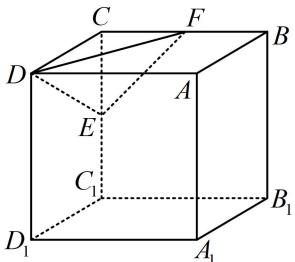

<!-- question-source:start -->
## 7.（2024·江西模拟·★★★★）（多选）

正方体 $ABCD - A_{1}B_{1}C_{1}D_{1}$ 的体积为8，线段 $CC_{1}$ ， $BC$ 的中点分别为 $E$ ， $F$ ，动点 $G$ 在下底面 $A_{1}B_{1}C_{1}D_{1}$ 内（含边界），动点 $H$ 在直线 $AD_{1}$ 上， $GE = AA_{1}$ ，则（）

A. 三棱锥 $H - DEF$ 的体积为定值  
B. 动点 $G$ 的轨迹长度为 $\frac{\sqrt{5}\pi}{2}$ C. 不存在点 $G$ ，使得 $EG \perp$ 平面 $DEF$ D. 四面体 $DEFG$ 体积的最大值为 $\frac{\sqrt{15} + 2}{6}$
<!-- question-source:end -->

![[Q00050890A1]]
