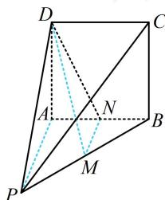

> [!faq]- 《第2节 综合小题》参考答案
>
> > [!success]- **【答案】** $\sqrt{5}$
>
> > [!note]- **【分析】**
> > 本题未单列分析。
>
> > [!note]- **【解析】**
> > 解析：求线线角，考虑平移成相交直线处理，这里有 M 为 PB 中点，故可构造中位线实现前述平移，如图，取 AB 中点 N，连接 MN, DN，
> > 因为 M 是 PB 中点，所以 $MN \parallel PA$ ,
> > 因为 $PA \perp$ 平面 ABCD，所以 $MN \perp$ 平面 ABCD，
> > 故 $MN \perp DN$ ，由题意可知， $MN = \frac{1}{2} PA = 1$ $AN=\frac{1}{2}AB=1,\quad AD=2,\quad DN=\sqrt{AD^{2}+AN^{2}}=\sqrt{5}$ 所以 $\tan\angle DMN=\frac{DN}{MN}=\sqrt{5}$ 故直线 DM 与 PA 所成角的正切值为 $\sqrt{5}$ .
> >
> > 
