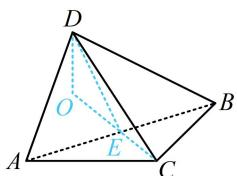

> [!faq]- 《第2节 综合小题》参考答案
>
> > [!success]- **【答案】** C
>
> > [!note]- **【分析】**
> > 本题未单列分析。
>
> > [!note]- **【解析】**
> > C
> > 解析：两个等腰三角形有公共的底边，这种情况常取底边中点构造线面垂直，
> > 如图，取 AB 中点 E，连接 DE，CE，由题意，DA = DB，
> > AC = BC，所以 $AB \perp DE$ ， $AB \perp CE$ 故 $\angle DEC$ 即为二面角 C-AB-D 的平面角，
> > 且 $AB \perp$ 平面 CDE，所以 $\angle DEC = 150^{\circ}$ 作 $DO \perp CE$ 的延长线于 O，则 $DO \subset$ 平面 CDE，
> > 所以 $DO \perp AB$ ，故 $DO \perp$ 平面 ABC，
> >
> > 所以 $\angle DCO$ 即为直线 $CD$ 与平面 $ABC$ 所成的角，
> >
> > 不妨设 $AB = 2$ ，则 $CE = 1$ ， $DE = \sqrt{3}$
> >
> > 因为 $\angle DEC = 150^{\circ}$ ，所以 $\angle DEO = 30^{\circ}$
> >
> > 故 $OE = DE \cdot \cos \angle DEO = \frac{3}{2}$ , $OD = DE \cdot \sin \angle DEO = \frac{\sqrt{3}}{2}$ ,
> >
> > $OC = OE + CE = \frac{5}{2}$ ，所以 $\tan \angle DCO = \frac{OD}{OC} = \frac{\sqrt{3}}{5}$
> >
> > 
>
> > [!tip]- **【反思】**
> > 再次强调，两个等腰三角形有公共底边这类图形，常取底边中点，构造两个线线垂直，进而得出线面垂直.
