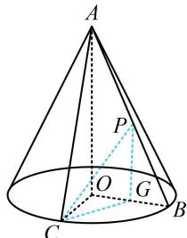
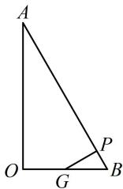

> [!faq]- 《第2节 综合小题》参考答案
>
> > [!success]- **【答案】** A
>
> > [!note]- **【分析】**
> > 本题未单列分析。
>
> > [!note]- **【解析】**
> > A
> >
> > 解析： $AO \perp$ 面 $BOC \Rightarrow \begin{cases} AO \perp OB \\ AO \perp OC \end{cases} \Rightarrow \angle BOC$ 是二面角
> >
> > $B - AO - C$ 的平面角，由题意， $\angle BOC = 60^{\circ}$
> >
> > 要找 $CP$ 与面 $AOB$ 所成的角，先过 $C$ 作面 $AOB$ 的垂线，注意到 $AO \perp$ 面 $BOC$ ，所以只需作 $OB$ 的垂线，如图1，取 $OB$ 中点 $G$ ，连接 $CG$ ， $PG$ ，因为 $OB = OC$ ， $\angle BOC = 60^{\circ}$ ，所以 $\triangle OBC$ 是正三角形，故 $CG \perp OB$ ，
> >
> > 结合 $CG \perp AO$ 可得 $CG \perp$ 面 $AOB$ ，所以 $\angle CPG$ 即为直线 $CP$ 与面 $AOB$ 所成的角， $\tan \angle CPG = \frac{CG}{PG}$ ①，不妨设 $OB = OC = 2$ ，则 $CG = \sqrt{3}$ ，代入①得： $\tan \angle CPG = \frac{\sqrt{3}}{PG}$ ②， $PG$ 最小时， $\tan \angle CPG$ 最大，因为 $\angle OAB = 30^{\circ}$ ，所以 $OA = 2\sqrt{3}$ ，如图2，当 $PG \perp AB$ 时， $PG$ 最小，所以 $PG_{\min} = BG \cdot \sin \angle PBG = \frac{\sqrt{3}}{2}$ ，代入②得 $(\tan \angle CPG)_{\max} = 2$ 。
> >
> >   
> > 图1
> >
> >   
> > 图2
> >
> > 类型 II：压轴综合多选题
