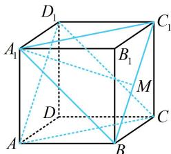
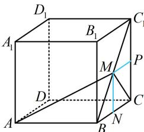
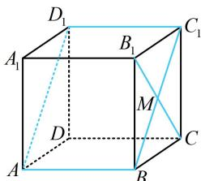

> [!faq]- 《第2节 综合小题》参考答案
>
> > [!success]- **【答案】** BD
>
> > [!note]- **【分析】**
> > 本题未单列分析。
>
> > [!note]- **【解析】**
> > BD
> >
> > 解析：A 项，观察发现当 M 在 $BC_{1}$ 上运动时， $A_{1}M$ 始终在面 $A_{1}BC_{1}$ 内，故若 $A_{1}M$ 始终与面 $ACD_{1}$ 不相交，那一定是面 $A_{1}BC_{1}$ 与面 $ACD_{1}$ 平行的情况，于是我们来看看这两个面是否平行，
> >
> > 如图1， $AC / / A_{1}C_{1}$ ， $AD_{1} / / BC_{1}$ ，所以面 $ACD_{1} / /$ 面 $A_{1}BC_{1}$ ，又 $A_{1}M\subset$ 面 $A_{1}BC_{1}$ ，所以 $A_{1}M / /$ 面 $ACD_{1}$ ，故A项错误；B项，若分别以 $A$ 和 $D_{1}$ 为顶点算体积，则高都不好找，考虑转换顶点.观察发现若都以 $M$ 为顶点，则底面分别为 $\triangle ACD$ 和 $\triangle CDD_{1}$ ，它们都在正方体的表面上，点 $M$ 到它们所在平面的距离容易找，故以 $M$ 为顶点来求两个三棱锥的体积，如图2，作 $MN\bot BC$ 于点 $N$ ， $MP\bot CC_1$ 于点 $P$ ，则 $MN\bot$ 平面 $ACD$ ， $MP\bot$ 平面 $CDD_{1}$ ，设 $MN = a$ ，则 $PC = a$ ， $C_1P = 2 - a$ ，结合 $\triangle MPC_1$ 为等腰Rt△可得 $MP = C_1P$ $= 2 - a$ ，所以 $V_{A - MCD} = V_{M - ACD} = \frac{1}{3} S_{\triangle ACD}\cdot MN$ $= \frac{1}{3}\times \frac{1}{2}\times 2\times 2\times a = \frac{2a}{3},V_{D_1 - MCD} = V_{M - CDD_1}\\ = \frac{1}{3} S_{\triangle CDD_1}\cdot MP = \frac{1}{3}\times \frac{1}{2}\times 2\times 2\times (2 - a) = \frac{4 - 2a}{3},$ 从而 $V_{A - MCD} + V_{D_1 - MCD} = \frac{2a}{3} +\frac{4 - 2a}{3} = \frac{4}{3}$ ，故B项正确；
> >
> >   
> > 图1
> >
> >   
> > 图2
> >
> > C 项， $\triangle AMC$ 的周长 $L_{\triangle AMC} = AM + CM + AC = AM + CM + 2\sqrt{2}$ ①，故只需找 $M$ 到 $A$ ， $C$ 两点距离之和的最小值，注意到 $AM$ 和 $CM$ 分别在面 $ABC_1$ 和面 $BCC_1$ 内，可将它们沿 $BC_1$ 翻折到同一平面上来看，
> >
> > 将 $\triangle BCC_{1}$ 沿 $BC_{1}$ 翻折，使其与 $\triangle ABC_{1}$ 在同一平面，如图3，当 $M$ 在 $BC_{1}$ 上运动时， $AM + MC \geq AC$ 当且仅当 $M$ 与图中 $M_{0}$ 重合时取等号，因为 $AB = BC = 2$ ， $\angle ABC = 135^{\circ}$ ，所以由余弦定理， $AC^{2} = AB^{2} + BC^{2} - 2AB \cdot BC \cdot \cos \angle ABC = 2^{2} + 2^{2} - 2 \times 2 \times 2 \times \cos 135^{\circ} = 8 + 4\sqrt{2}$ ，故 $AC = \sqrt{8 + 4\sqrt{2}}$ 所以 $AM + MC \geq \sqrt{8 + 4\sqrt{2}}$ ，代入①得 $L_{\triangle AMC} \geq \sqrt{8 + 4\sqrt{2}} + 2\sqrt{2}$ ，故C项错误；
> >
> > D 项，如图 4，平面 $AD_{1}C_{1}$ 即平面 $ABC_{1}D_{1}$ ，当 M 为 $BC_{1}$ 中点时， $CM \perp BC_{1}$ ，又 $AB \perp$ 平面 $BCC_{1}B_{1}$ ，所以 $CM \perp AB$ ，从而 $CM \perp$ 平面 $ABC_{1}D_{1}$ ，故 $CM \perp$ 平面 $AD_{1}C_{1}$ ，所以 CM 与平面 $AD_{1}C_{1}$ 成 $90^{\circ}$ 角，线面角不超过 $90^{\circ}$ ，从而此时 CM 与平面 $AD_{1}C_{1}$ 所成角最大，故 D 项正确.
> >
> >   
> > 图3
> >
> >   
> > 图4
