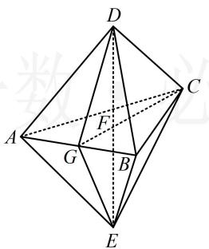
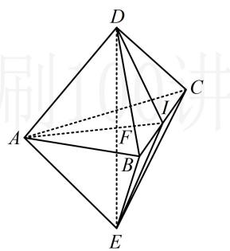

> [!faq]- 《第2节 综合小题》参考答案
>
> > [!success]- **【答案】** AC
>
> > [!note]- **【分析】**
> > 本题未单列分析。
>
> > [!note]- **【解析】**
> > AC
> >
> > 解析：A项，几何体的表面由6个边长为1的正三角形组成，故表面积为 $6\times\frac{1}{2}\times1\times1\times\sin\frac{\pi}{3}=\frac{3\sqrt{3}}{2}$ ，故A项正确；
> > B 项，如图 1，设直线 $DE \cap$ 平面 ABC = F，
> >
> > $CF\cap AB = G$ ，由图形的对称性， $F$ 为 $\triangle ABC$ 的中心，且 $DE\bot$ 平面 $ABC$ ，所以 $CF = \frac{2}{3} CG = \frac{2}{3}\times \frac{\sqrt{3}}{2}\times 1 = \frac{\sqrt{3}}{3},$ $DF = \sqrt{CD^2 - CF^2} = \frac{\sqrt{6}}{3}$ ，故 $V_{D - ABC} = \frac{1}{3} S_{\triangle ABC}\cdot DF$ $= \frac{1}{3}\times \frac{1}{2}\times 1\times 1\times \sin \frac{\pi}{3}\times \frac{\sqrt{6}}{3} = \frac{\sqrt{2}}{12},$ 所以该几何体的体积为 $2V_{D - ABC} = \frac{\sqrt{2}}{6}$ ，故B项错误；
> >
> > C项，分析面面垂直，先找线面垂直，注意到各面都是正三角形，所以棱的垂面容易构造出来，下面我们以 $AB$ 为例来分析，如图1， $AB\bot DG$ ， $AB\bot EG$ ，
> >
> > 所以 $AB \perp$ 平面CDGE，故平面 $ABC \perp$ 平面CDGE，
> >
> > 所以该几何体过 $A, B, C$ 三点的截面与过 $C, D, E$ 三点的截面垂直，故C项正确；
> >
> > D 项, 直观想象可以得出 ${AD}$ 与平面 ${BCE}$ 相交,它们不平行. 若要严格论证,可先假设它们平行,由此出发推矛盾,
> >
> > 假设 $AD \parallel$ 平面 $BCE$ ，如图2，设 $AF \cap BC = I$
> >
> > 因为 $AD \subset$ 平面 ADIE，平面 $ADIE \cap$ 平面 BCE = IE，
> >
> > 所以 $AD \parallel IE$ ，故 $\frac{AF}{IF} = \frac{DF}{EF}$ ，
> >
> > 实际上，因为 $F$ 是 $\triangle ABC$ 的中心，也是重心，
> >
> > 所以 $\frac{AF}{IF} = 2$ ，而 $\frac{DF}{EF} = 1$ ，所以 $\frac{AF}{IF} \neq \frac{DF}{EF}$ ，矛盾，
> >
> > 所以 $AD$ 与平面 $BCE$ 不平行，故D项错误.
> >
> >   
> > 图1
> >
> >   
> > 图2
