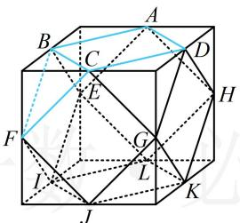
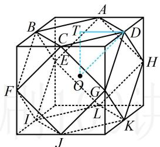

> [!faq]- 《第2节 综合小题》参考答案
>
> > [!success]- **【答案】** ABD
>
> > [!note]- **【分析】**
> > 本题未单列分析。
>
> > [!note]- **【解析】**
> > ABD
> >
> > 解析：A 项，如图 1，顶点有 A, B, C, D, E, F, G, H, I, J, K, L，共 12 个，它们都是正方体的棱中点，故 A 项正确；B 项，一条条地数可行，但图形较复杂，容易数错，可先找该多面体的正方形面或三角形面有几个，再来计算棱的条数，如图 1，该几何体中像 ABCD 这样的正方形面有 6 个，共 $6 \times 4 = 24$ 条棱，此时结合图形可发现几何体的每条棱都刚好只在一个正方形中，所以该几何体的棱数为 24，故 B 项正确；
> >
> > C项，因为正方体的棱长为 $40\mathrm{cm}$ ，所以该几何体每条棱的长都为 $20\sqrt{2}\mathrm{cm}$ ，由图可知该几何体的表面由6个正方形和8个正三角形构成，所以其表面积 $S = 6\times (20\sqrt{2})^2 +$
> >
> > $8 \times \frac{1}{2} \times 20\sqrt{2} \times 20\sqrt{2} \times \sin 60^{\circ} = (4800 + 1600\sqrt{3}) \, \text{cm}^{2}$ ，故 C 项错误；
> >
> > D项，结论涉及的球的表面积关系依赖于它们半径的关系，故不妨先把结论翻译成半径的关系，再判断，
> >
> > 设该几何体的外接球半径为 $R$ ，原正方体的内切球、外接球半径分别为 $R_{1}$ ， $R_{2}$ ，则此项的结论即为 $2\times 4\pi R^2 = 4\pi R_1^2 +4\pi R_2^2$ ，化简得： $2R^{2} = R_{1}^{2} + R_{2}^{2}$ ①，
> >
> > 由图形的对称性，该几何体的外接球球心为正方体的中心 $O$ ，如图2，半径 $R = OD$
> >
> > 设 $T$ 为正方形ABCD的中心，则 $OT \perp$ 平面ABCD，
> >
> > 所以 $OT \perp TD$ 且 $OT = TD = 20\mathrm{cm}$ ,
> >
> > 故 $R = OD = \sqrt{OT^2 + TD^2} = 20\sqrt{2}\mathrm{cm},$
> >
> > 又原正方体的内切球半径 $R_{1} = \frac{1}{2}\times 40 = 20\mathrm{cm}$ ，外接球半径 $R_{2} = \frac{1}{2}\times 40\sqrt{3} = 20\sqrt{3}\mathrm{cm}$
> >
> > 所以 $R_{1}^{2} + R_{2}^{2} = 1600 = 2R^{2}$ ，从而式①成立，故D项正确.
> >
> >   
> > 图1
> >
> >   
> > 图2
