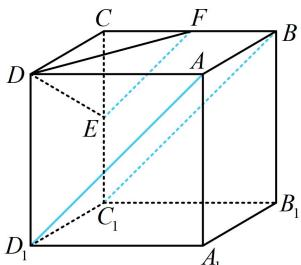
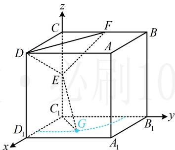

> [!faq]- 《第2节 综合小题》参考答案
>
> > [!success]- **【答案】** ACD
>
> > [!note]- **【分析】**
> > 本题未单列分析。
>
> > [!note]- **【解析】**
> > ACD
> >
> > 解析：A项，由于 $\triangle DEF$ 是不变的，故若 $V_{H - DEF}$ 为定值，则 $H$ 到平面DEF的距离不变，而 $H$ 在直线 $AD_{1}$ 上运动，所以应有直线 $AD_{1} / /$ 平面DEF，于是只需看此线面平行是否成立，
> >
> > 如图1，由 $E$ ， $F$ 分别是 $CC_{1}$ ， $BC$ 的中点可得 $EF / / BC_{1}$ ，由正方体的结构特征可知 $BC_{1} / / AD_{1}$ ，所以 $AD_{1} / / EF$ 所以 $AD_{1} / /$ 平面DEF，故 $H$ 到平面DEF的距离 $d$ 不变，又 $S_{\triangle DEF}$ 也不变，所以 $V_{H - DEF} = \frac{1}{3} S_{\triangle DEF}\cdot d$ 为定值，故A项正确；
> >
> >   
> > 图1
> >
> > B项，设正方体的棱长为 $a$ ，则由题意，正方体的体积
> >
> > $V=a^{3}=8$ ，所以a=2，故 $GE=AA_{1}=2$ ，
> >
> > 怎样由此寻找点 G 的轨迹？注意到 G 在面 $A_{1}B_{1}C_{1}D_{1}$ 内，故考虑把 GE 转化到面 $A_{1}B_{1}C_{1}D_{1}$ 内来分析，
> >
> > 因为 $C_1E \perp$ 平面 $A_1B_1C_1D_1$ ，所以 $C_1E \perp C_1G$
> >
> > 从而 $C_1G = \sqrt{GE^2 - C_1E^2} = \sqrt{3}$ ，故点 $G$ 在以 $C_1$ 为圆心， $\sqrt{3}$ 为半径的圆上，如图2，点 $G$ 的轨迹是一段四分之一圆弧，所以点 $G$ 的轨迹长度为 $\frac{1}{4}\times 2\pi \times \sqrt{3} = \frac{\sqrt{3}\pi}{2}$ ，故B项错误；
> >
> >   
> > 图2
> >
> > C项，用几何的方法找面DEF的垂线稍显麻烦，线面垂直容易用向量法处理，正方体建系也方便，故考虑建系，以 $C_1$ 为原点建立如图2所示的空间直角坐标系，
> >
> > 则 $E(0,0,1)$ ， $D(2,0,2)$ ， $F(0,1,2)$
> >
> > 由B项的分析， $G$ 在以 $C_1$ 为圆心， $\sqrt{3}$ 为半径且圆心角为 $\angle B_{1}C_{1}D_{1} = \frac{\pi}{2}$ 的圆弧上，
> >
> > 故可设 $G(\sqrt{3}\cos \theta ,\sqrt{3}\sin \theta ,0)$ ， $0\leq \theta \leq \frac{\pi}{2}$
> >
> > 所以 $\overrightarrow{EG} = (\sqrt{3}\cos \theta ,\sqrt{3}\sin \theta , - 1)$ ， $\overrightarrow{ED} = (2,0,1)$
> >
> > $\overrightarrow{DF} = (-2,1,0)$ ，设平面 $DEF$ 的法向量为 $\pmb {m} = (x,y,z)$
> >
> > 则 $\left\{ \begin{array}{l} \pmb{m} \cdot \overrightarrow{ED} = 2x + z = 0 \\ \pmb{m} \cdot \overrightarrow{DF} = -2x + y = 0 \end{array} \right.$ ，令 $x = 1$ ，则 $y = 2$ ， $z = -2$ ，
> >
> > 所以 $\pmb {m} = (1,2, - 2)$ 是平面DEF的一个法向量，
> >
> > 若 $EG \perp$ 平面 DEF，则 $\overrightarrow{EG} \parallel m$ ，
> >
> > 所以 $\frac{\sqrt{3}\cos\theta}{1} = \frac{\sqrt{3}\sin\theta}{2} = \frac{-1}{-2}$
> >
> > 故 $\cos \theta = \frac{\sqrt{3}}{6}$ ， $\sin \theta = \frac{\sqrt{3}}{3}$ ，不满足 $\cos^2\theta +\sin^2\theta = 1$
> >
> > 所以不存在点 $G$ ，使得 $EG \perp$ 平面 $DEF$ ，故C项正确；
> >
> > D 项， $DE = \sqrt{CD^{2} + CE^{2}} = \sqrt{5}$ ， $EF = \sqrt{CE^{2} + CF^{2}} = \sqrt{2}$
> >
> > $DF = \sqrt{CD^2 + CF^2} = \sqrt{5}$
> >
> > 因为 $DE = DF$ ，所以等腰 $\triangle DEF$ 的底边 $EF$ 上的高为 $\sqrt{DE^2 - \left(\frac{1}{2} EF\right)^2} = \frac{3\sqrt{2}}{2}$ ，故 $S_{\triangle DEF} = \frac{1}{2}\times \sqrt{2}\times \frac{3\sqrt{2}}{2} = \frac{3}{2},$
> >
> > 于是求 $V_{DEFG}$ 的最大值核心是求 $G$ 到面 $DEF$ 距离的最大值，该距离可用向量法计算，故先算该距离，再分析最值，由C项分析可知 $\overrightarrow{EG} = (\sqrt{3}\cos \theta ,\sqrt{3}\sin \theta , - 1)$ ，平面 $DEF$ 的一个法向量为 $\pmb {m} = (1,2, - 2)$ 所以点 $G$ 到平面 $DEF$ 的距离 $d^{\prime} = \frac{\left|\overrightarrow{EG}\cdot\pmb{m}\right|}{\left|\pmb{m}\right|}$ $= \frac{\left|\sqrt{3}\cos\theta + 2\sqrt{3}\sin\theta + 2\right|}{\sqrt{1^2 + 2^2 + (-2)^2}} = \frac{\left|\sqrt{15}\sin(\theta + \varphi) + 2\right|}{3},$ 其中 $\tan \varphi = \frac{1}{2}$ ，且 $\varphi$ 为锐角，因为 $\theta \in \left[0,\frac{\pi}{2}\right]$ ，所以当 $\theta = \frac{\pi}{2} -\varphi$ 时， $\sin (\theta +\varphi) = \sin \frac{\pi}{2} = 1$ ，此时 $d^{\prime}$ 取得最大值 $\frac{\sqrt{15} + 2}{3}$ 所以 $(V_{G - DEF})_{\max} = \frac{1}{3}\times \frac{3}{2}\times \frac{\sqrt{15} + 2}{3} = \frac{\sqrt{15} + 2}{6}$ ，故D项正确.
> >
> > 折纸是一种高雅的艺术活动, 已知正方形纸片 $ABCD$ 的边长为 2 , 现将 $\triangle ACD$ 沿对角线 $AC$ 旋转 $180^{\circ}$ , 记旋转过程中点 $D$ 的位置为点 $P$ (不含起始位置和与 $B$ 重合的情形), $AC$ , $AP$ , $BC$ 的中点分别为 $O$ , $E$ , $F$ , 则 ( )
> >
> > A. $AC \perp BP$ B. $PB + PD$ 的最大值为 $4 \sqrt{2}$ C. 旋转过程中, $EF$ 与平面 $BOP$ 所成角的正弦值的取值范围是 $\left(\frac{\sqrt{2}}{2}, 1\right)$ D. $\triangle ACD$ 旋转形成的几何体的体积是 $\frac{2 \sqrt{2} \pi}{3}$
