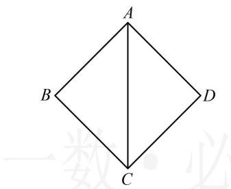
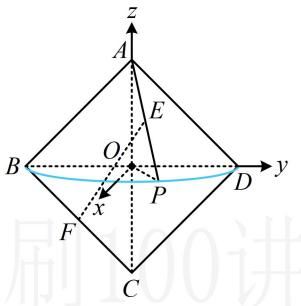

> [!faq]- 《第2节 综合小题》参考答案
>
> > [!success]- **【答案】** ACD
>
> > [!note]- **【分析】**
> > 本题未单列分析。
>
> > [!note]- **【解析】**
> > ACD
> >
> > ACD
> > 解析： $\triangle ACD$ 旋转过程中形成的是两个共底面的半圆锥，如图2，
> > A项，BP在半圆所在的平面上， $AC \perp$ 半圆所在平面，
> > 所以 $AC \perp BP$ ，故 A 项正确；
> > B 项，点 P 在半圆上，故先由勾股定理找到 PB，PD 的关系，再分析最值， $PB \perp PD \Rightarrow PB^{2} + PD^{2} = BD^{2} = 8$ ，
> > 所以 $(PB + PD)^{2} = PB^{2} + PD^{2} + 2PB \cdot PD$ $\leq 2(PB^{2} + PD^{2}) = 16$ ，故 $PB + PD \leq 4$ 当且仅当 PB = PD = 2 时取等号，
> > 所以 PB + PD 的最大值为 4，故 B 项错误；
> > C 项，几何法分析此线面角较困难，考虑建系，用向量法处理，
> > 如图2 建系，则 $A(0,0,\sqrt{2})$ ， $B(0,-\sqrt{2},0)$ ， $C(0,0,-\sqrt{2})$ ， $F\left(0,-\frac{\sqrt{2}}{2},-\frac{\sqrt{2}}{2}\right)$
> >
> > 点 $P$ 在半圆上运动，在 $xOy$ 平面内，该半圆的方程为 $x^{2} + y^{2} = 2(x > 0)$ ，故可设 $P(\sqrt{2}\cos \alpha ,\sqrt{2}\sin \alpha ,0)$ 其中 $-\frac{\pi}{2} <  \alpha <  \frac{\pi}{2}$ ，所以 $E\left(\frac{\sqrt{2}}{2}\cos \alpha ,\frac{\sqrt{2}}{2}\sin \alpha ,\frac{\sqrt{2}}{2}\right)$ 故 $\overrightarrow{FE} = \left(\frac{\sqrt{2}}{2}\cos \alpha ,\frac{\sqrt{2}}{2}\sin \alpha +\frac{\sqrt{2}}{2},\sqrt{2}\right),$ 由图可知 $\pmb {n} = (0,0,1)$ 是平面BOP的一个法向量，设 $EF$ 与平面 $BOP$ 所成的角为 $\theta$ ，则 $\sin \theta = |\cos <   \overrightarrow{FE},\pmb {n} > |$ $= \frac{| \overrightarrow{FE} \cdot \pmb{n}|}{|\overrightarrow{FE}|\cdot|\pmb{n}|} = \frac{\sqrt{2}}{\sqrt{\frac{1}{2}\cos^2\alpha + (\frac{\sqrt{2}}{2}\sin\alpha + \frac{\sqrt{2}}{2})^2 + 2}} = \frac{\sqrt{2}}{\sqrt{3 + \sin\alpha}},$ 因为 $-\frac{\pi}{2} <  \alpha <  \frac{\pi}{2}$ ，所以 $-1 <   \sin \alpha <  1$ ，从而 $\frac{\sqrt{2}}{2} <  \sin \theta <  1$ 故C项正确；
> >
> > D项，该旋转体的上下两部分可拼接成一个完整的圆锥，其底面半径和高都是 $\sqrt{2}$
> >
> > 所以其体积 $V = \frac{1}{3}\pi \times (\sqrt{2})^2 \times \sqrt{2} = \frac{2\sqrt{2}\pi}{3}$ ，故D项正确.
> >
> >   
> > 图1
> >
> >   
> > 图2
