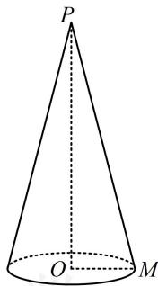
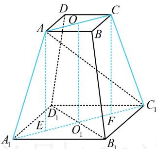
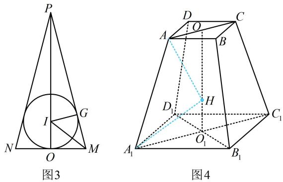

> [!faq]- 《第2节 综合小题》参考答案
>
> > [!success]- **【答案】** BC
>
> > [!note]- **【分析】**
> > 本题未单列分析。
>
> > [!note]- **【解析】**
> > BC
> >
> > 解析：A项，圆锥 $PO$ 已知底面直径，求体积还差高，条件还给出了圆锥 $PO$ 的线长度为4，直观想象可知，圆锥表面上任意两点距离的最大值只可能是母线长或底面直径，这里底面直径小于4，所以线长度即为母线长，我们先由此分析圆锥的高，如图1，由题意，圆锥 $PO$ 的底面半径 $OM = \frac{1}{2} \times 2 = 1$ ，圆锥的线长度为 $PM = 4$ ，所以圆锥的高 $PO = \sqrt{PM^2 - OM^2} = \sqrt{15}$ ，从而其体积 $V = \frac{1}{3}\pi \cdot OM^2 \cdot PO$
> >
> > $= \frac{1}{3}\pi \times 1^{2} \times \sqrt{15} = \frac{\sqrt{15}\pi}{3}$ ，故A项错误；
> >
> > B 项, 如图 2, 正四棱台是规则几何体, 常选取过高的截面来分析问题, 结合所求为 $AA_{1}$ 与底面所成的角可知应选取包含高和 $AA_{1}$ 的截面来分析, 即图 2 中的截面 $AA_{1}C_{1}C$ ,
> >
> > 作 $AE \perp A_{1}C_{1}$ 于点 $E$ ， $CF \perp A_{1}C_{1}$ 于点 $F$
> >
> > 则 $AE \perp$ 平面 $A_{1}B_{1}C_{1}D_{1}$ ，因为 $AB = 2$ ， $A_{1}B_{1} = 4$ ，
> >
> > 所以 $AC = 2\sqrt{2}$ ， $A_{1}C_{1} = 4\sqrt{2}$ ， $A_{1}E = C_{1}F = \frac{1}{2} (A_{1}C_{1} - EF)$
> >
> > $$
> > = \frac {1}{2} (A _ {1} C _ {1} - A C) = \frac {1}{2} \times (4 \sqrt {2} - 2 \sqrt {2}) = \sqrt {2}
> > $$
> >
> > 求目标线面角的正切值还差 $AE$ ，怎么求？已知条件还有正四棱台的线长度为 6，可以想象，正四棱台表面上任意两点距离的最大值只可能为 $AC_{1}$ 或 $A_{1}C_{1}$ ，这里 $A_{1}C_{1}<6$ ，所以线长度应为 $AC_{1}$ ，故可将 $AE$ 放到直角 $\triangle AEC_{1}$ 中来算，
> >
> > 正四棱台 $ABCD - A_{1}B_{1}C_{1}D_{1}$ 的线长度为 $6 \Rightarrow AC_{1} = 6$
> >
> > 又 $EC_{1} = A_{1}C_{1} - A_{1}E = 3\sqrt{2}$ ，所以 $AE = \sqrt{AC_1^2 - EC_1^2} = 3\sqrt{2}$
> >
> > 从而 $\tan \angle AA_{1}E = \frac{AE}{A_{1}E} = \frac{3\sqrt{2}}{\sqrt{2}} = 3$ ，即 $AA_{1}$ 与底面 $A_{1}B_{1}C_{1}D_{1}$ 所成角的正切值为3，故B项正确；
> >
> >   
> > 图1
> >
> >   
> > 图2
> >
> > C 项, 内切球的线长度即为内切球直径, 圆锥和球都是旋转体, 选取任意过轴的截面来分析内切球半径均可, 如图 3, $\triangle PMN$ 是圆锥的一个轴截面, $O$ , $G$ 为切点,
> >
> > 设圆锥 $PO$ 的内切球半径为 $r$ ，则 $IO = IG = r$
> >
> > $PI = PO - IO = \sqrt{15} - r$ ，由切线长相等， $GM = OM = 1$
> >
> > 所以 $PG = PM - GM = 4 - 1 = 3$
> >
> > 在 $\triangle PIG$ 中， $PG^{2} + IG^{2} = PI^{2}$
> >
> > 所以 $9 + r^2 = (\sqrt{15} - r)^2$ ，解得： $r = \frac{\sqrt{15}}{5}$
> >
> > 从而圆锥 $PO$ 内切球的线长度为 $2r = \frac{2\sqrt{15}}{5}$ ，故C项正确；
> >
> > D项，可以想象，正四棱台比较“瘦高”，故猜想球心在正四棱台内部，如图4，我们先按此计算，
> >
> > 设正四棱台外接球的球心为 $H$ ，半径为 $R$
> >
> > 则 $HA = HA_{1} = R \Rightarrow OH = \sqrt{HA^{2} - OA^{2}} = \sqrt{R^{2} - 2}$
> >
> > $O_{1}H = \sqrt{HA_{1}^{2} - O_{1}A_{1}^{2}} = \sqrt{R^{2} - 8}$ ，由图4可知， $OH + O_1H$
> >
> > $= OO_{1}$ ，所以 $\sqrt{R^2 - 2} +\sqrt{R^2 - 8} = 3\sqrt{2}$
> >
> > 从而 $\sqrt{R^2 - 2} = 3\sqrt{2} -\sqrt{R^2 - 8}$ ，故 $R^2 -2 =$
> >
> > $18 - 6\sqrt{2(R^2 - 8)} + R^2 - 8$ ，化简得： $\sqrt{R^2 - 8} = \sqrt{2}$
> >
> > 所以 $R^2 - 8 = 2$ ，从而 $R = \sqrt{10}$
> >
> > R 有解，所以球心确实在棱台内部，之前的猜想正确，
> >
> > 故正四棱台外接球的表面积 $S = 4\pi R^2 = 40\pi$ ，故D项错误
> >
> > 
> >
> > 一数·必刷100讲
