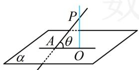
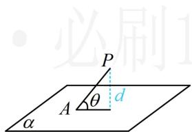
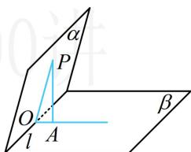
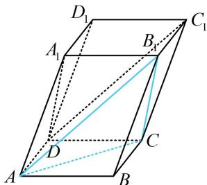
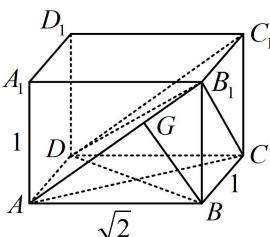
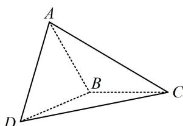
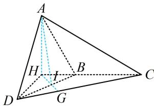

<!-- source-part:1 pages:1-9 -->

# 第2节 综合小题（★★★★）

## 内容提要

本节主要涉及偏压轴难度的立体几何综合多选题，小伙伴们根据自身的实际情况来选择性学习。在此之前，先学习空间角度的计算方法，作为铺垫，这一块（类型Ⅰ）难度不高。

1. 线线角的计算：核心是通过平移使其相交，到三角形中来算.

2. 线面角的计算：有两种几何的方法.

①作垂线: 如图 1, 要求直线 $PA$ 与平面 $\alpha$ 所成的角, 只需过 $P$ 作 $\alpha$ 的垂线, 找到垂足 $O$ , 求 $\angle PAO$ .

②算距离: 如图 2, 若不方便过 $P$ 作平面 $\alpha$ 的垂线, 也可用等体积法或其它方法求出点 $P$ 到平面 $\alpha$ 的距离 $d$ , 再按 $\sin \theta = \frac{d}{PA}$ 来求线面角.

3. 二面角的计算: 核心是作平面角, 若与棱垂直的射线好找, 则直接作, 否则如图3, 可先过 $\alpha$ 内的点 $P$ 作 $\beta$ 的垂线, 找到垂足 $A$ , 再过 $P$ 作 $l$ 的垂线 $PO$ , 垂足为 $O$ , 则由三垂线定理可知 $l \perp OA$ , 所以 $\angle POA$ 即为二面角 $\alpha - l - \beta$ 的平面角, 这种找二面角的方法叫做三垂线法, 其中 $PO$ 和 $OA$ 的作法可交换.

  
图1

  
图2

  
图3

4. 综合多选题：这类题往往难度大，几何法、向量法都是考虑的方向，具体问题具体分析.类型I：空间角的计算综合小题

【例1】在平行六面体 $ABCD - A_{1}B_{1}C_{1}D_{1}$ 中, 底面 $ABCD$ 是边长为 1 的正方形, $\angle A_{1}AD = \angle A_{1}AB = 60^{\circ}$ , $AA_{1} = 2$ , 则异面直线 $AC$ 与 $DC_{1}$ 所成角的余弦值为 ( )

A. $\frac{\sqrt{14}}{7}$ B. $\frac{\sqrt{6}}{3}$ C. $\frac{\sqrt{6}}{4}$ D. $\frac{3\sqrt{14}}{14}$

解析：求异面直线所成的角，可通过平移使其相交，到三角形内来分析. 只需将 $DC_{1}$ 移到点 $A$ 处，如图， $AB_{1} / / DC_{1}$ ，由题设可求得 $AC = \sqrt{2}$ ， $A_{1}D^{2} = AA_{1}^{2} + AD^{2} - 2AA_{1}\cdot AD\cdot \cos \angle A_{1}AD = 3$ 所以 $A_{1}D = \sqrt{3}$ ，故 $B_{1}C = \sqrt{3}$ ， $\angle A_1AB = 60^\circ \Rightarrow \angle AA_1B_1 = 120^\circ$ 所以 $AB_{1}^{2} = AA_{1}^{2} + A_{1}B_{1}^{2} - 2AA_{1}\cdot A_{1}B_{1}\cdot \cos \angle AA_{1}B_{1} = 7$ ，故 $AB_{1} = \sqrt{7}$ 在 $\triangle AB_{1}C$ 中，由余弦定理， $\cos \angle B_{1}AC = \frac{AB_{1}^{2} + AC^{2} - B_{1}C^{2}}{2AB_{1}\cdot AC} = \frac{3\sqrt{14}}{14}$ 故异面直线 $AC$ 与 $DC_{1}$ 所成角的余弦值为 $\frac{3\sqrt{14}}{14}$

答案: D

【反思】在求异面直线所成的角的小题中，常通过平移使它们成为相交直线，到三角形内进行分析.

【例2】长方体 $ABCD - A_{1}B_{1}C_{1}D_{1}$ 中，已知 $B_{1}D$ 与平面 $ABCD$ 和平面 $AA_{1}B_{1}B$ 所成的角均为 $30^{\circ}$ ，则（）  
A. $AB = 2AD$ B. $AC = B_{1}C$ C. $B_{1}D$ 与平面 $BB_{1}C_{1}C$ 所成的角为 $45^{\circ}$ D. $AB$ 与平面 $AB_{1}C_{1}D$ 所成的角为 $30^{\circ}$

解析：长方体中有较多的线面垂直，故先分析题干所给的线面角，找到长、宽、高的关系， $BB_{1} \perp$ 平面 $ABCD \Rightarrow B_{1}D$ 与平面 $ABCD$ 所成的角为 $\angle B_{1}DB$ ， $AD \perp$ 平面 $AA_{1}B_{1}B \Rightarrow B_{1}D$ 与平面 $AA_{1}B_{1}B$ 所成的角为 $\angle AB_{1}D$ ，由题意， $\angle B_{1}DB = \angle AB_{1}D = 30^{\circ}$ ，不妨设 $AA_{1} = 1$ ，则 $\tan \angle B_{1}DB = \frac{BB_{1}}{BD} = \frac{\sqrt{3}}{3} \Rightarrow BD = \sqrt{3}$ ，设 $AB = a$ ， $AD = b$ ，则 $a^{2} + b^{2} = 3$ ①， $\tan \angle AB_{1}D = \frac{AD}{AB_{1}} = \frac{\sqrt{3}}{3} \Rightarrow \frac{b}{\sqrt{a^{2} + 1}} = \frac{\sqrt{3}}{3}$ ②，联立①②解得： $a = \sqrt{2}$ ， $b = 1$ ，A项，由前面的计算可知， $AB = \sqrt{2}$ ， $AD = 1$ ，所以 $AB = \sqrt{2} AD$ ，故A项错误；B项， $AC = \sqrt{AB^{2} + BC^{2}} = \sqrt{3}$ ， $B_{1}C = \sqrt{BB_{1}^{2} + BC^{2}} = \sqrt{2}$ ，所以 $AC \neq B_{1}C$ ，故B项错误；C项， $DC \perp$ 平面 $BB, CC \Rightarrow BD$ 与平面 $BB, CC$ 所成的角为 $\angle DBC$ 。

因为 $\tan \angle DB_{1}C = \frac{CD}{B_{1}C} = \frac{\sqrt{2}}{\sqrt{2}} = 1$ ，所以 $\angle DB_{1}C = 45^{\circ}$ ，故C项正确；D项，作 $BG\perp AB_{1}$ 于 $G$ ，因为 $AD\perp$ 面 $ABB_{1}A_{1}$ ，所以 $BG\perp AD$ 从而 $BG\perp$ 平面 $AB_{1}C_{1}D$ ，故 $\angle BAG$ 是 $AB$ 与平面 $AB_{1}C_{1}D$ 所成的角， $\tan \angle BAG = \frac{BB_1}{AB} = \frac{\sqrt{2}}{2}\Rightarrow \angle BAG\neq 30^{\circ}$ ，故D项错误.

答案: C

【反思】找线面角的核心是过直线上的点作面的垂线，找到垂足，也就找到了线面角.

【例 3】如图，已知 $\triangle ABC$ 和 $\triangle DBC$ 所在的平面互相垂直，AB = BC = BD， $\angle ABC = \angle DBC = 120^{\circ}$ ，则二面角 A - BD - C 的正切值等于 \_\_\_\_.

解析：条件有面面垂直，可方便地作交线的垂线找到线面垂直，故用“三垂线法”作二面角的平面角，

如图，作 $AH \perp CB$ 的延长线于 $H$ ，因为平面 $ABC \perp$ 平面 $DBC$ ，所以 $AH \perp$ 平面 $DBC$ ①，作 $HI \perp BD$ 于点 $I$ 交 $CD$ 于点 $G$ ，又由①可得 $BD \perp AH$ ，所以 $BD \perp$ 平面 $AHI$ ，故 $BD \perp AI$ ，所以 $\angle AIG$ 即为二面角 $A - BD - C$ 的平面角，且 $\angle AIG = \pi -\angle AIH$

故 $\tan \angle AIG = \tan (\pi -\angle AIH) = -\tan \angle AIH$ ②，要算 $\tan \angle AIH$ ，只需到 Rt△AHI 中计算 $AH$ 和 $HI$

$$
\angle A B C = \angle D B C = 1 2 0 ^ {\circ}
$$

$$
\angle A B H = \angle D B H = 6 0 ^ {\circ}
$$

$$
A B = B C = B D = 2
$$

$$
A H = A B \cdot \sin \angle A B H = \sqrt {3}
$$

$BH = AB \cdot \cos \angle ABH = 1$ ，在 $\triangle HBI$ 中， $HI = BH \cdot \sin \angle HBI = 1 \times \sin 60^{\circ} = \frac{\sqrt{3}}{2}$ 所以 $\tan\angle AIH=\frac{AH}{HI}=2$ ，代入②得 $\tan\angle AIG=-2$ ，
故二面角 A-BD-C 的正切值为 -2.

答案: -2

【反思】作二面角的平面角常用“三垂线法”，只需过一个面内的点向另一个面作垂线，找到垂足，再过垂足作二面角棱的垂线，即可找到二面角的平面角.

![[高中/总复习/教辅/一数常规版2026/第9章 立体几何、空间向量/模块4 综合提升篇/第2节 综合小题/类型02_综合多选题/类型02_综合多选题.md]]
![[高中/总复习/教辅/一数常规版2026/第9章 立体几何、空间向量/模块4 综合提升篇/第2节 综合小题/强化训练/强化训练.md]]
