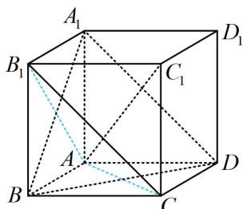
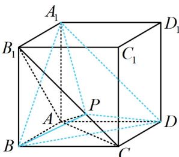
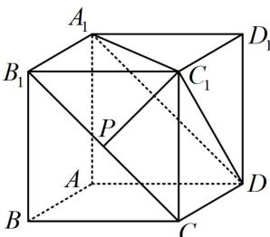

> [!faq]- 《第2节 综合小题》例题解析
>
> > [!success]- **【答案】** ABD
>
> > [!note]- **【分析】**
> > 本题未单列分析。
>
> > [!note]- **【解析】**
> > A. 直线 $AC_{1} \perp$ 平面 $A_{1}BD$ B. 三棱锥 $P-A_{1}BD$ 的体积为定值
> >
> > C. 异面直线 AP 与 $A_{1}D$ 所成角的取值范围是 $\left[\frac{\pi}{6}, \frac{\pi}{2}\right]$ D. 直线 $C_{1}P$ 与平面 $A_{1}C_{1}D$ 所成角的正弦值的最大值为 $\frac{\sqrt{6}}{3}$
> >
> > 解析：A项，判断线面垂直，需找线线垂直，正方体中，线在表面的射影好找，故考虑三垂线定理法，如图1， $AC_{1}$ 在面 $ABB_{1}A_{1}$ 内的射影为 $AB_{1}$ ，由三垂线定理， $A_{1}B \perp AB_{1} \Rightarrow A_{1}B \perp AC_{1}$ ，同理， $BD \perp AC_{1}$ ，所以 $AC_{1} \perp$ 平面 $A_{1}BD$ ，故A项正确；  
> > B项，如图2，注意到 $B_{1}C \parallel A_{1}D$ ，所以 $B_{1}C \parallel$ 平面 $A_{1}BD$ ，故点 $P$ 到平面 $A_{1}BD$ 的距离为定值，又 $\triangle A_{1}BD$ 的面积不变，所以三棱锥 $P - A_{1}BD$ 的体积为定值，故B项正确；  
> > C项，注意到 $B_{1}C \parallel A_{1}D$ ，所以只需分析 $AP$ 与 $B_{1}C$ 所成的角，可到 $\triangle AB_{1}C$ 中来看，如图2， $\triangle AB_{1}C$ 为正三角形，当 $P$ 在 $B_{1}C$ 上运动时， $AP$ 与 $B_{1}C$ 所成的角的最小值为 $\angle AB_{1}C = \frac{\pi}{3}$ ，最大值为 $\frac{\pi}{2}$ （ $AP \perp B_{1}C$ 时取得），故C项错误；  
> > D项， $P$ 是动点，不易过 $P$ 作面 $A_{1}C_{1}D$ 的垂线，建系处理也麻烦，故考虑公式 $\sin \theta = \frac{d}{PC_1}$ ，先求 $d$ ，如图3， $B_{1}C \parallel A_{1}D \Rightarrow B_{1}C \parallel$ 面 $A_{1}C_{1}D$ ，所以运动过程中，点 $P$ 到面 $A_{1}C_{1}D$ 的距离 $d$ 是定值，可按点 $C$ 到面 $A_{1}C_{1}D$ 的距离求 $d$ ，用等体积法， $V_{A_1 - CC_1D} = V_{C - A_1C_1D} \Rightarrow \frac{1}{3} \times \frac{1}{2} \times 2 \times 2 \times 2 = \frac{1}{3} \times \frac{1}{2} \times 2\sqrt{2} \times 2\sqrt{2} \times \frac{\sqrt{3}}{2} \times d$ ，解得： $d = \frac{2\sqrt{3}}{3}$ ，当 $PC_{1} \perp B_{1}C$ 时， $PC_{1}$ 最小，所以 $(PC_{1})_{\min} = \sqrt{2}$ ，从而 $(\sin \theta)_{\max} = \frac{\frac{2\sqrt{3}}{3}}{\sqrt{2}} = \frac{\sqrt{6}}{3}$ ，故D项正确.
> >
> >
> >   
> > 图1
> >
> >   
> > 图2
> >
> >   
> > 图3
