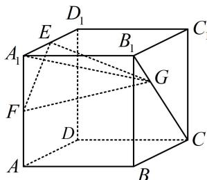
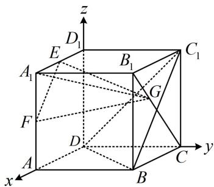
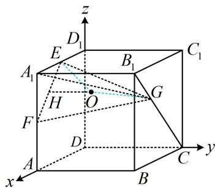

> [!faq]- 《第2节 综合小题》例题解析
>
> > [!success]- **【答案】** ACD
>
> > [!note]- **【分析】**
> > 本题未单列分析。
>
> > [!note]- **【解析】**
> > A. 三棱锥 $A_{1}-EFG$ 的体积为定值
> >
> > B. 线段 $B_{1}C$ 上存在点 $G$ , 使平面 $EFG \parallel$ 平面 $BDC_{1}$ C. 设直线 $FG$ 与平面 $BCC_{1}B_{1}$ 所成角为 $\theta$ , 则 $\cos \theta$ 的最小值为 $\frac{1}{3}$ D. 三棱锥 $A_{1}-EFG$ 的外接球半径的最大值为 $\frac{3\sqrt{2}}{2}$
> >
> > 
> >
> > 解析：A项，因为 $B_{1}C \parallel$ 面 $A_{1}EF$ ，所以点 $G$ 到面 $A_{1}EF$ 的距离不变，又 $\triangle A_{1}EF$ 的面积也不变，所以三棱锥 $A_{1} - EFG$ 的体积为定值，故A项正确；B项，如图1，注意到 $EF \parallel BC_{1}$ ，所以面 $EFG \parallel$ 面 $BDC_{1} \Leftrightarrow EG \parallel$ 面 $BDC_{1}$ 直接观察不易看出上述平行关系能否成立，可建系处理，如图建系，设 $\overrightarrow{B_1G} = \lambda \overrightarrow{B_1C} (0\leq \lambda \leq 1)$ 由图可知， $D(0,0,0)$ ， $E(1,0,2)$ ， $B_{1}(2,2,2)$ ， $C(0,2,0)$ ， $B(2,2,0)$ ， $C_{1}(0,2,2)$ ，
> >
> > 所以 $\overrightarrow{DB}=(2,2,0)$ ， $\overrightarrow{DC_{1}}=(0,2,2)$ ，设平面 $BDC_{1}$ 的法向量为 $\boldsymbol{n}=(x,y,z)$ ，则 $\left\{\begin{aligned}\boldsymbol{n}\cdot\overrightarrow{DB}&=2x+2y=0\\\boldsymbol{n}\cdot\overrightarrow{DC_{1}}&=2y+2z=0\end{aligned}\right.$ 令 x=1，则 $\left\{\begin{aligned}y&=-1\\ z&=1\end{aligned}\right.$ ，所以 $\boldsymbol{n}=(1,-1,1)$ 是平面 $BDC_{1}$ 的一个法向量， $\overrightarrow{EG}=\overrightarrow{EB_{1}}+\overrightarrow{B_{1}G}=\overrightarrow{EB_{1}}+\lambda\overrightarrow{B_{1}C}=(1,2,0)+\lambda(-2,0,-2)=(1-2\lambda,2,-2\lambda)$ 令 $\overrightarrow{EG}\cdot n=1-2\lambda-2-2\lambda=0$ 得： $\lambda=-\frac{1}{4}$ ，不满足 $0\leq\lambda\leq1$ 所以不存在点 G，使平面 EFG // 平面 $BDC_{1}$ ，故 B 项错误；
> >
> > C项，可以用几何法作出线面角来分析，但平面 $BCC_{1}B_{1}$ 的法向量能直接看出，故用向量法也好做，下面我们用向量法来求解。由于 $\cos\theta=\sqrt{1-\sin^{2}\theta}$ ，所以当 $\sin\theta$ 最大时， $\cos\theta$ 最小，
> > 因为 $F(2,0,1)$ ，所以 $\overrightarrow{FG}=\overrightarrow{FB_{1}}+\overrightarrow{B_{1}G}=\overrightarrow{FB_{1}}+\lambda\overrightarrow{B_{1}C}=(0,2,1)+\lambda(-2,0,-2)=(-2\lambda,2,1-2\lambda)$ 如图1， $m=(0,1,0)$ 是面 $BCC_{1}B_{1}$ 的一个法向量，故 $\sin\theta=\left|\cos<\overrightarrow{FG},m>\right|=\frac{\left|\overrightarrow{FG}\cdot\boldsymbol{m}\right|}{\left|\overrightarrow{FG}\right|\cdot\left|\boldsymbol{m}\right|}=\frac{2}{\sqrt{8\lambda^{2}-4\lambda+5}}$ 当 $\lambda=\frac{1}{4}$ 时， $\sin\theta$ 取得最大值 $\frac{2\sqrt{2}}{3}$ ，所以 $(\cos\theta)_{\min}=\sqrt{1-\left(\frac{2\sqrt{2}}{3}\right)^{2}}=\frac{1}{3}$ ，故 C 项正确；
> > D项，如图2，观察发现三棱锥 $A_{1}-GEF$ 的外接球没有模型可套用，但 $\triangle A_{1}EF$ 为直角三角形，其外心比较好找，故过外心作面 $A_{1}EF$ 的垂线，则球心必在该垂线上，
> > 如图2，取EF中点H，过H作面 $A_{1}EF$ 的垂线，因为 $H\left(\frac{3}{2},0,\frac{3}{2}\right)$ ，所以可设球心为 $O\left(\frac{3}{2},m,\frac{3}{2}\right)$ ，
> >
> > 要求 $m$ ，需建立方程，可根据 $OE = OG$ ，用空间两点距离公式来建立，
> >
> > $$
> > \overrightarrow {O G} = \overrightarrow {O B _ {1}} + \overrightarrow {B _ {1} G} = \overrightarrow {O B _ {1}} + \lambda \overrightarrow {B _ {1} C} = \left(\frac {1}{2}, 2 - m, \frac {1}{2}\right) + \lambda (- 2, 0, - 2) = \left(\frac {1}{2} - 2 \lambda , 2 - m, \frac {1}{2} - 2 \lambda\right),
> > $$
> >
> > 由 $OE = OG$ 可得 $\sqrt{\left(\frac{3}{2} - 1\right)^2 + (m - 0)^2 + \left(\frac{3}{2} - 2\right)^2} = \sqrt{\left(\frac{1}{2} - 2\lambda\right)^2 + (2 - m)^2 + \left(\frac{1}{2} - 2\lambda\right)^2}$ ，整理得： $m = 2\lambda^2 - \lambda + 1$ ，
> >
> > $$
> > O E = \sqrt {m ^ {2} + \frac {1}{2}} = \sqrt {(2 \lambda^ {2} - \lambda + 1) ^ {2} + \frac {1}{2}} = \sqrt {\left[ 2 \left(\lambda - \frac {1}{4}\right) ^ {2} + \frac {7}{8} \right] ^ {2} + \frac {1}{2}}
> > $$
> >
> > 故当 $\lambda = 1$ 时， $OE$ 取得最大值 $\frac{3\sqrt{2}}{2}$ ，即所求外接球半径的最大值为 $\frac{3\sqrt{2}}{2}$ ，故D项正确.
> >
> >
> >   
> > 图1
> >
> >   
> > 图2
>
> > [!tip]- **【总结】**
> > 立体几何综合题变化多且难度大，一般优先考虑几何法，如无思路再尝试建系，建系前应评估计算量，以免计算过于复杂。立体几何综合题类型繁杂，本节练习题部分有更多类型供大家训练。
