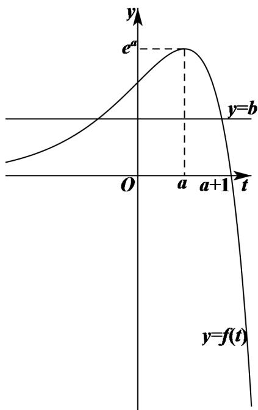

> [!faq]- 2解析
>
> > [!success]- **【答案】** D
>
> > [!note]- **【分析】**
> > 根据导数几何意义求得切线方程，再构造函数，利用导数研究函数图象，结合图形确定结果
>
> > [!note]- **【解析】**
> > 在曲线 $y=e^{x}$ 上任取一点 $P(t,e^{t})$ ，对函数 $y=e^{x}$ 求导得 $y' = e^{x}$ ，
> >
> > 所以，曲线 $y=e^{x}$ 在点 P 处的切线方程为 $y-e^{t}=e^{t}(x-t)$ ，即 $y=e^{t}x+(1-t)e^{t}$ ，
> >
> > 由题意可知，点 $(a,b)$ 在直线 $y=e^{t}x+(1-t)e^{t}$ 上，可得 $b=ae^{t}+(1-t)e^{t}=(a+1-t)e^{t}$ ，
> >
> > 令 $f(t) = (a + 1 - t)e^t$ ，则 $f'(t) = (a - t)e^t$ .
> >
> > 当 $t < a$ 时， $f'(t) > 0$ ，此时函数 $f(t)$ 单调递增，
> >
> > 当 $t > a$ 时， $f'(t) < 0$ ，此时函数 $f(t)$ 单调递减，
> >
> > 所以， $f(t)_{\max}=f(a)=e^{a}$
> >
> > 由题意可知，直线 $y = b$ 与曲线 $y = f(t)$ 的图象有两个交点，则 $b < f(t)_{\max} = e^a$ ，当 $t < a + 1$ 时， $f(t) > 0$ ，当 $t > a + 1$ 时， $f(t) < 0$ ，作出函数 $f(t)$ 的图象如下图所示：
> >
> > 
> >
> > 由图可知，当 $0 < b < e^{a}$ 时，直线 $y = b$ 与曲线 $y = f(t)$ 的图象有两个交点.故选：D.
> >
> > 【点睛】数形结合是解决数学问题常用且有效的方法
