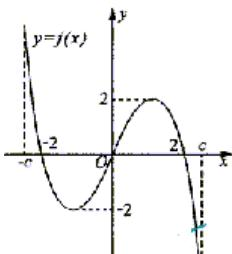

<!-- question-source:start -->
16. A. P. B. Q. C. M. D. N. （）

16. $f(X)$ 是定义在区间 $[-c, c]$ 上的奇函数，其图象如图所示：令 $g(X) = af(X) + b$ ，则下

列关于函数 $g(X)$ 的叙述正确的是  
A. 若 $a < 0$ , 则函数 $g(X)$ 的图象关于原点对称.  
B. 若 $a = 1, 0 < b < 2$ , 则方程 $g(X) = 0$ 有大于 2 的实根.  
C. 若 $a = -2, b = 0$ , 则函数 $g(x)$ 的图象关于 $y$ 轴对称  
D. 若 $a = 0, b = 2$ , 则方程 $g(X) = 0$ 有三个实根.

##
<!-- question-source:end -->

![[高中/真题/按年份分类/2003/2003年上海高考数学真题_文科_试卷_word版_/选择题/题目/answers/Q00027694A1.md]]
