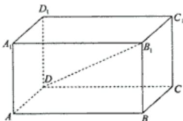

> [!faq]- 2003年上海高考数学真题（文科）试卷（word版）解析
>
> > [!success]- **【答案】** [解]连结 BD，因为 $B_{1}B \perp$ 平面 ABCD， $B_{1}D \perp BC$ ，所以 $BC \perp BD$
>
> > [!note]- **【分析】**
> > 本题解析推导如下：
>
> > [!note]- **【解析】**
> > [解]连结 BD，因为 $B_{1}B \perp$ 平面 ABCD， $B_{1}D \perp BC$ ，所以 $BC \perp BD$ .
> >
> > 在 $\triangle BCD$ 中，BC=2，CD=4，所以 $BD=2\sqrt{3}$ .
> >
> > 又因为直线 $B_{1}D$ 与平面 ABCD 所成的角等于 $30^{\circ}$ ，所以
> >
> > $\angle B_{1}DB=30^{\circ}$ ，于是 $BB_{1}=\frac{1}{\sqrt{3}}BD=2.$
> >
> > 故平行六面体 ABCD— $A_{1}B_{1}C_{1}D_{1}$ 的体积为 $S_{ABCD}\cdot BB_{1}=8\sqrt{3}$ .
> >
> > 
