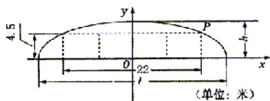

<!-- question-source:start -->
20. （本题满分 14 分）本题共有 2 个小题，第 1 小题满分 6 分，第 2 小题满分 8 分.
如图, 某隧道设计为双向四车道, 车道总宽 22 米, 要求通行车辆限高 4.5 米, 隧道全长 2.5 千米, 隧道的拱线近似地看成半个椭圆形状.

(1) 若最大拱高 $h$ 为 6 米, 则隧道设计的拱宽 $I$ 是多少?

(2) 若最大拱高 h 不小于 6 米，则应如何设计拱高 h 和拱宽 l，才能使半个椭圆形隧道的土方工程量最最小？

(半个椭圆的面积公式为 $S = \frac{\pi}{4} lh$ ，柱体体积为：底面积乘以高.本题结果精确到 0.1 米)
<!-- question-source:end -->

![[高中/真题/按年份分类/2003/2003年上海高考数学真题_理科_试卷_word版_/解答题/题目/answers/Q00023238A1.md]]
