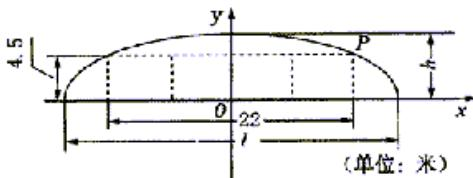

> [!faq]- 2003年上海高考数学真题（理科）试卷（word版）解析
>
> > [!success]- **【答案】** [解] （1）如图建立直角坐标系，则点 P（11，4
>
> > [!note]- **【分析】**
> > 本题解析推导如下：
>
> > [!note]- **【解析】**
> > [解]
> > （1）如图建立直角坐标系，则点 P（11，4.5），椭圆方程为 $\frac{x^{2}}{a^{2}} + \frac{y^{2}}{b^{2}} = 1$ .
> >
> > 将 $b = h = 6$ 与点 $P$ 坐标代入椭圆方程，得 $a = \frac{44\sqrt{7}}{7}$ ，此时 $l = 2a = \frac{88\sqrt{7}}{7} \approx 33.3$ . 因此隧道的拱宽约为 33.3 米.
> >
> > (2) [解一]
> >
> > 由椭圆方程 $\frac{x^2}{a^2} +\frac{y^2}{b^2} = 1$ 得 $\frac{11^2}{a^2} +\frac{4.5^2}{b^2} = 1.$
> >
> > 
> >
> > 因为 $\frac{11^2}{a^2} +\frac{4.5^2}{b^2}\geq \frac{2\times 11\times 4.5}{ab}$ 即 $ab\geq 99$ ，且 $l = 2a,h = b,$
> >
> > 所以 $S=\frac{\pi}{4}lh=\frac{\pi ab}{2}\geq\frac{99\pi}{2}.$
> >
> > 当S取最小值时,有 $\frac{11^{2}}{a^{2}}=\frac{4.5^{2}}{b^{2}}=\frac{1}{2}$ ,得 $a=11\sqrt{2},b=\frac{9\sqrt{2}}{2}$
> >
> > 此时 $l = 2a = 22\sqrt{2}\approx 31.1,h = b\approx 6.4$
> >
> > 故当拱高约为 6.4 米、拱宽约为 31.1 米时，土方工程量最小.
> >
> > [解二]由椭圆方程 $\frac{x^{2}}{a^{2}}+\frac{y^{2}}{b^{2}}=1$ ，得 $\frac{11^{2}}{a^{2}}+\frac{4.5^{2}}{b^{2}}=1$ 。于是 $b^{2}=\frac{81}{4}\cdot\frac{a^{2}}{a^{2}-121}$
> >
> > $$
> > a ^ {2} b ^ {2} = \frac {8 1}{4} \left(a ^ {2} - 1 2 1 + \frac {1 2 1 ^ {2}}{a ^ {2} - 1 2 1} + 2 4 2\right) \geq \frac {8 1}{4} \left(2 \sqrt {1 2 1 ^ {2}} + 2 4 2\right) = 8 1 \times 1 2 1,
> > $$
> >
> > 即 $ab \geq 99$ , 当S取最小值时, 有 $a^{2} - 121 = \frac{121^{2}}{a^{2} - 121}$ ,
> >
> > 得 $a = 11\sqrt{2}, b = \frac{9\sqrt{2}}{2}$ . 以下同解
> > 一.
