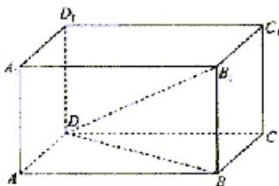

> [!faq]- 2003年上海高考数学真题（理科）试卷（word版）解析
>
> > [!success]- **【答案】** [解]
>
> > [!note]- **【分析】**
> > 本题解析推导如下：
>
> > [!note]- **【解析】**
> > [解] (1)
> >
> > 
> >
> > $$
> > a _ {1} C _ {2} ^ {0} - a _ {2} C _ {2} ^ {1} + a _ {3} C _ {2} ^ {2} = a _ {1} - 2 a _ {1} q + a _ {1} q ^ {2} = a _ {1} (1 - q) ^ {2},
> > $$
> >
> > $$
> > a _ {1} C _ {3} ^ {0} - a _ {2} C _ {3} ^ {1} + a _ {3} C _ {3} ^ {2} - a _ {4} C _ {3} ^ {3} = a _ {1} - 3 a _ {1} q + 3 a _ {1} q ^ {2} - a _ {1} q ^ {3} = a _ {1} (1 - q) ^ {3}.
> > $$
> > (2) 归纳概括的结论为:
> >
> > 若数列 $\{a_{n}\}$ 是首项为 $a_1$ ，公比为q的等比数列，则
> >
> > $$
> > \begin{array}{r l} & {a _ {1} C _ {n} ^ {0} - a _ {2} C _ {n} ^ {1} + a _ {3} C _ {n} ^ {2} - a _ {4} C _ {n} ^ {3} + \ldots + (- 1) ^ {n} a _ {n + 1} C _ {n} ^ {n} = a _ {1} (1 - q) ^ {n}, n \text {为正整数}.} \\ & {\text {证明}: a _ {1} C _ {n} ^ {0} - a _ {2} C _ {n} ^ {1} + a _ {3} C _ {n} ^ {2} - a _ {4} C _ {n} ^ {3} + \ldots + (- 1) ^ {n} a _ {n + 1} C _ {n} ^ {n}} \\ & {\qquad = a _ {1} C _ {n} ^ {0} - a _ {1} q C _ {n} ^ {1} + a _ {1} q ^ {2} C _ {n} ^ {2} - a _ {1} q ^ {3} C _ {n} ^ {3} + \ldots + (- 1) ^ {n} a _ {1} q ^ {n} C _ {n} ^ {n}} \\ & {\qquad = a _ {1} [ C _ {n} ^ {0} - q C _ {n} ^ {1} + q ^ {2} C _ {n} ^ {2} - q ^ {3} C _ {n} ^ {3} + \ldots + (- 1) ^ {n} q ^ {n} C _ {n} ^ {n} ] = a _ {1} (1 - q) ^ {n}} \end{array}
> > $$
