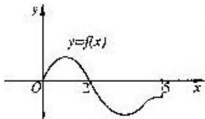

<!-- question-source:start -->
5. 设奇函数 $f(x)$ 的定义域为 $[-5, 5]$ . 若当 $x \in [0, 5]$ 时, $f(x)$ 的图象如右图, 则不等式 $f(x) < 0$ 的解是 \_\_\_\_.

<!-- question-source:end -->

![[高中/真题/按年份分类/2004/2004年上海高考数学真题_文科_试卷_word版_/填空题/题目/answers/Q00023857A1.md]]
