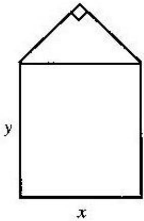

<!-- question-source:start -->
18. (本题满分 12 分)

部是等腰直角三角形. 要求框架围成的总面积 $8m^{2}$ . 问 x、y 分别为多少(精确到 0.001m) 时用料最省?

<!-- question-source:end -->

![[高中/真题/按年份分类/2004/2004年上海高考数学真题_文科_试卷_word版_/解答题/题目/answers/Q00023870A1.md]]
