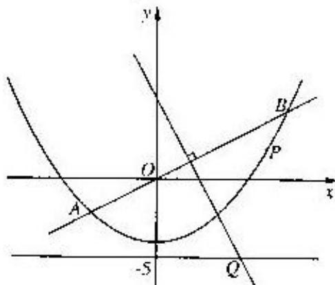

<!-- question-source:start -->
20. (本题满分 14 分) 第 1 小题满分 6 分, 第 2 小题满分 8 分

如图, 直线 $y=\frac{1}{2}x$ 与抛物线 $y=\frac{1}{8}x^{2}-4$ 交于 A、B 两点, 线段 AB 的垂直平分线与直线 y=-5 交于 Q 点.

(1) 求点 $Q$ 的坐标;

(2) 当 P 为抛物线上位于线段 AB 下方(含点 A、B) 的动点时, 求 $\triangle OPQ$ 面积的最大值.

<!-- question-source:end -->

![[高中/真题/按年份分类/2004/2004年上海高考数学真题_文科_试卷_word版_/解答题/题目/answers/Q00023872A1.md]]
