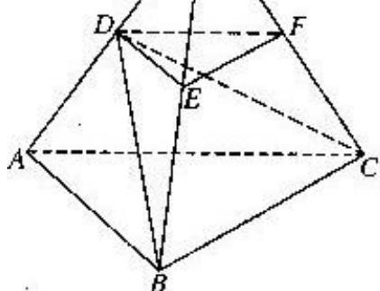

<!-- question-source:start -->
21. (本题满分 16 分) 第 1 小题满分 4 分, 第 2 小题满分 6 分, 第 3 小题满分 6 分

如图, P—ABC 是底面边长为 1 的正三棱锥, D、E、F 分别为棱长 PA、PB、PC 上的点, 截面 DEF∥底面 ABC, 且棱台 DEF—ABC 与棱锥 P—ABC 的棱长和相等。(棱长和是指多面体中所有棱的长度之和)

(1)证明：P—ABC为正四面体；

(2)若 $PD=\frac{1}{2}PA$ ，求二面角 D—BC—A 的大小；(结果用反三角函数值表示)

(3)设棱台 DEF—ABC 的体积为 V, 是否存在体积为 V 且各棱长均相等的直平行六面体, 使得它与棱台 DEF—ABC 有相同的棱长和? 若存在,请具体构造出这样的一个直平行六面体, 并给出证明; 若不存在,请说明理由.

<!-- question-source:end -->

![[高中/真题/按年份分类/2004/2004年上海高考数学真题_理科_试卷_word版_/解答题/题目/answers/Q00023261A1.md]]
