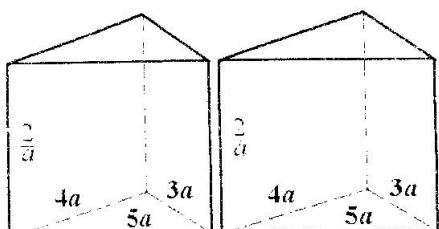

<!-- question-source:start -->
12. 有两个相同的直三棱柱，高为 $\frac{2}{a}$ ，底面三角形的三边长分别为 3a,4a,5a(a > 0).用它们拼成一个三棱柱或四棱柱，在所有可能的情形中，全面积最小的是一个四棱柱，则 a 的取值范围是 \_\_\_\_.

<!-- question-source:end -->

![[高中/真题/按年份分类/2005/2005年上海高考数学真题_文科_试卷_word版_/填空题/题目/answers/Q00023752A1.md]]
