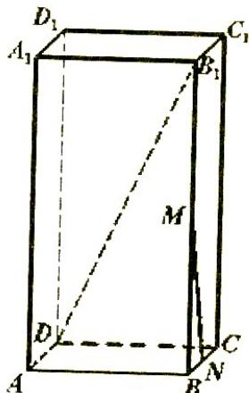

<!-- question-source:start -->
17. (本题满分 12 分) 已知长方体 $ABCD - A_1B_1C_1D_1$ 中, M、N 分别是 $BB_1$ 和 BC 的中点, AB=4, AD=2, $B_1D$ 与平面 ABCD 所成角的大小为 $60^{\circ}$ ，求异面直线 $B_{1}D$ 与MN所成角的大小。（结果用反三角函数值表示）

<!-- question-source:end -->

![[高中/真题/按年份分类/2005/2005年上海高考数学真题_文科_试卷_word版_/解答题/题目/answers/Q00023757A1.md]]
