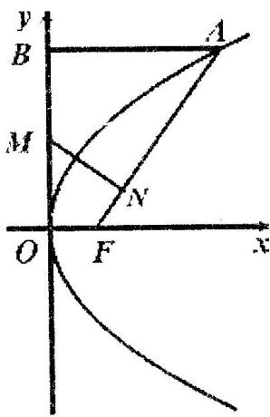

<!-- question-source:start -->
21. (本题满分 16 分) 本题共有 3 个小题, 第 1 小题满分 4 分, 第 2 小题满分 6 分, 第 3 小题满分 6 分.

已知抛物线 $y^{2} = 2px (p > 0)$ 的焦点为 F, A 是抛物线上横坐标为 4、且位于 $x$ 轴上方的点，A 到抛物线准线的距离等于 5。过 A 作 AB 垂直于 $y$ 轴，垂足为 B，OB 的中点为 M.

(1) 求抛物线方程;

(2) 过 M 作 $MN \perp FA$ ，垂足为 N，求点 N 的坐标；

(3) 以 M 为圆心, MB 为半径作圆 M, 当 $K(m,0)$ 是 $x$ 轴上一动点时, 讨论直线 AK 与圆

M 的位置关系.

<!-- question-source:end -->

![[高中/真题/按年份分类/2005/2005年上海高考数学真题_文科_试卷_word版_/解答题/题目/answers/Q00023761A1.md]]
