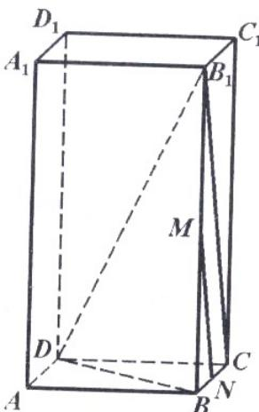

> [!faq]- 2005年上海高考数学真题（文科）试卷（word版）解析
>
> > [!success]- **【答案】** [解]联结 $\mathrm{B}_{1}\mathrm{C}$ ，由M、N分别是 $\mathrm{BB}_{1}$ 和BC的中点，得 $\mathrm{B}_{1}\mathrm{C} / / \mathrm{M}$ ∴∠DB $_1$ C就是异面直线 $\mathrm{B}_{1}\mathrm{D}$ 与MN所成的角。联结BD，在Rt△ABD中，可得 $BD =
>
> > [!note]- **【分析】**
> > 本题解析推导如下：
>
> > [!note]- **【解析】**
> > [解]联结 $\mathrm{B}_{1}\mathrm{C}$ ，由M、N分别是 $\mathrm{BB}_{1}$ 和BC的中点，得 $\mathrm{B}_{1}\mathrm{C} / / \mathrm{M}$ ∴∠DB $_1$ C就是异面直线 $\mathrm{B}_{1}\mathrm{D}$ 与MN所成的角。联结BD，在Rt△ABD中，可得 $BD = 2\sqrt{5}$ ，又BB $_1$ ⊥平面ABCD。∠B $_1$ DB是B $_1$ D与平面ABCD的所成的角，∴∠B $_1$ DB=60°。在Rt△B $_1$ BD中，BB $_1$ =BDtan60°=2√15，又DC⊥平面BB $_1$ C $_1$ C，∴DC⊥B $_1$ C，在Rt△CB $_1$ C中，tan∠DB $_1$ C= $\frac{DC}{B_1C}=\frac{DC}{\sqrt{BC^2+BB_1^2}}=\frac{1}{2}$ ∴∠DB $_1$ C=arctan $\frac{1}{2}$ ，即异面直线B $_1$ D与MN所成角的大小为arctan $\frac{1}{2}$ 。
> >
> > 
> > 18. 解：原方程化简为 $|z|^2 + (z + \bar{z})i = 1 - i$ 设 $z = x + yi(x, y \in R)$ ，代入上述方程得
> >
> > $$
> > x ^ {2} + y ^ {2} + 2 x i = 1 - i, \quad \therefore \left\{ \begin{array}{l} x ^ {2} + y ^ {2} = 1 \\ 2 x = - 1 \end{array} , \right.
> > $$
> >
> > 解得 $\left\{ \begin{array}{ll}x = -\frac{1}{2}\\ y = \pm \frac{\sqrt{3}}{2} \end{array} \right.$ ∴原方程的解是 $z = -\frac{1}{2}\pm \frac{\sqrt{3}}{2} i.$
> >
> > 19. 解：
> > （1）由已知得 $A(-\frac{b}{k},0)$ , $B(0,b)$ ，则 $\overrightarrow{AB}=\left\{\frac{b}{k},b\right\}$ 于是 $\left\{\begin{aligned}\frac{b}{k}&=2,\\ b&=2\end{aligned}\right.$ $\therefore\left\{\begin{aligned}k&=1\\ b&=2\end{aligned}\right.$
> > (2) 由 $f(x)>g(x)$ ，得 $x+2>x^{2}-x-6$ 即 $(x+2)(x-4)<0$ ，得 -2<x<4， $\frac{g(x)+1}{f(x)}=\frac{x^{2}-x-5}{x+2}=x+2+\frac{1}{x+2}-5,$ 由于 $x+2>0,$ 则 $\frac{g(x)+1}{f(x)}\geq-3$ ，其中等号当且仅当 $x+2=1$ ，即 x=-1 时成立，
> > ∴ $\frac{g(x)+1}{f(x)}$ 时的最小值是 -3.
> > 20. 解：
> > （1）设中低价房面积形成数列 $\left\{a_{n}\right\}$ ，由题意可知 $\left\{a_{n}\right\}$ 是等差数列，
> > 其中 $a_{1}=250,\quad d=50$ ，则 $S_{n}=250n+\frac{n(n-1)}{2}\times50=25n^{2}+225n,$ 令 $25n^{2} + 225n \geq 4750,$ 即 $n^{2} + 9n - 190 \geq 0,$ 而 n 是正整数, $\therefore n \geq 10.$
> >
> > ∴到2013年底，该市历年所建中低价房的累计面积将首次不少于4750万平方米.
> >
> > $$
> > \{\mathsf {b} _ {\mathrm{n}} \}
> > $$
> >
> > $$
> > \{\mathsf {b} _ {\mathrm{n}} \}
> > $$
> >
> > 其中 $b_{1}=400,\quad q=1.08,$ 则 $b_{n}=400\cdot(1.08)^{n-1}$
> >
> > 由题意可知 $a_{n} > 0.85b_{n}$
> >
> > 有 $250+(n-1)50>400\cdot(1.08)^{n-1}\cdot0.
> > 85.$
> >
> > 由计算器解得满足上述不等式的最小正整数 n=6，
> >
> > ∴到2009年底，当年建造的中低价房的面积占该年建造住房面积的比例首次大于85%.
> > 21. 解：
> > （1）抛物线 $y^{2}=2px$ 的准线为 $x=-\frac{p}{2}$ ，于是 $4+\frac{p}{2}=5,\therefore p=2$ .
> > ∴抛物线方程为 $y^{2}=4x$ .
> > (2) $\because$ 点A的坐标是（4，4），由题意得B（0，4），M（0，2），
> >
> > 又∵F（1，0），∴ $k_{FA}=\frac{4}{3};MN\perp FA,\therefore k_{MN}=-\frac{3}{4},$
> >
> > 则FA的方程为 $y = \frac{4}{3} (x - 1)$ ，MN的方程为 $y - 2 = -\frac{3}{4} x$ .
> >
> > 解方程组 $\left\{ \begin{array}{l} y = \frac{4}{3} (x - 1) \\ y - 2 = -\frac{3}{4} x \end{array} \right.$ , 得 $\left\{ \begin{array}{l} x = \frac{8}{5} \\ y = \frac{4}{5} \end{array} \right.$ $\therefore N(\frac{8}{5}, \frac{4}{5}).$
> > (3) 由题意得, 圆 $\mathrm{M}$ 的圆心是点 (0, 2), 半径为 2.
> >
> > 当 $m = 4$ 时，直线AK的方程为 $x = 4$ ，此时，直线AK与圆M相离，
> >
> > 当 $m = 4$ 时，直线AK的方程为 $y = \frac{4}{4 - m} (x - m)$ ，即为 $4x - (4 - m)y - 4m = 0,$
> >
> > 圆心M（0，2）到直线AK的距离 $d = \frac{|2m + 8|}{\sqrt{16 + (m - 4)^2}}$ ，令 $d > 2$ ，解得 $m > 1$
> >
> > ∴当 $m>1$ 时，直线AK与圆M相离；
> >
> > 当 m=1 时，直线 AK 与圆 M 相切；
> >
> > 当 $m < 1$ 时，直线AK与圆M相交.
> > 22. 解
> > (1) $h(x) = \begin{cases} (-2x + 3)(x - 2) & x \in [1, +\infty) \\ x - 2 & x \in (-\infty, 1) \end{cases}$
> > (2) 当 $x \geq 1$ 时, $h(x) = (-2x + 3)(x - 2) = -2x^2 + 7x - 6 = -2(x - \frac{7}{4})^2 + \frac{1}{8}$ . $\therefore h(x) \leq \frac{1}{8}$ ; 当 $x < 1$ 时, $h(x) < -1$ , $\therefore$ 当 $x = \frac{7}{4}$ 时, $h(x)$ 取得最大值是 $\frac{1}{8}$ .
> >
> > (3) [解法一]令 $f(x) = \sin x + \cos x, \alpha = \frac{\pi}{2}$ ,
> >
> > $$
> > g (x) = f (x + \alpha) = \sin \left(x + \frac {\pi}{2}\right) + \cos \left(x + \frac {\pi}{2}\right) = \cos x - \sin x,
> > $$
> >
> > 于是 $h(x) = f(x)\cdot f(x + \alpha) = (\cos x + \sin x)(\cos x - \sin x) = \cos 2x.$
> >
> > [解法二]令 $f(x) = 1 + \sqrt{2}\sin x,\alpha = \pi$
> >
> > 则 $g(x) = f(x + \alpha) = 1 + \sqrt{2}\sin (x + \pi) = 1 - \sqrt{2}\sin x,$
> >
> > 于是 $h(x) = f(x)\cdot f(x + \alpha) = (1 + \sqrt{2}\sin x)(1 - \sqrt{2}\sin x) = 1 - 2\sin^2 x = \cos 2x.$
