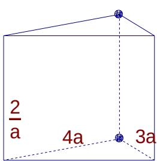
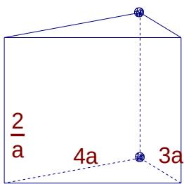

<!-- question-source:start -->
10. 函数

$f(x) = \sin x + 2|\sin x| \quad x \in [0, 2\pi]$ 的图像与直线 $y = k$ 又且仅有两个不同的交点，则

  
5a

  
5a

k 的取值范围是 \_\_\_\_
<!-- question-source:end -->

![[高中/真题/按年份分类/2005/2005年上海高考数学真题_理科_试卷_word解析版_/填空题/题目/answers/Q00023295A1.md]]
