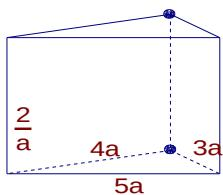

> [!faq]- 2005年上海高考数学真题（理科）试卷（word解析版）解析
>
> > [!success]- **【答案】** 详见解析
>
> > [!note]- **【分析】**
> > 本题未单列分析。
>
> > [!note]- **【解析】**
> > ①拼成一个三棱柱时，只有一种一种情况，就是将上下底面对接，其全面积为
> >
> > 
> >
> > $$
> > S _ {\text {三棱柱表面}} = 2 \times \frac {1}{2} \times 3 a \times 4 a + (3 a + 4 a + 5 a) \times \frac {4}{a} = 1 2 a ^ {2} + 4 8
> > $$
> >
> > ② 拼成一个四棱柱, 有三种情况, 就是分别让边长为 $3a, 4a, 5a$ 所在的侧面重合, 其上下底面积之和都是 $2 \times 2 \times \frac{1}{2} \times 3a \times 4a = 24a^2$ , 但侧面积分别为: $2(4a + 5a) \times \frac{2}{a} = 36, 2(3a + 5a) \times \frac{2}{a} = 32, 2(3a + 4a) \times \frac{2}{a} = 28$ , 显然, 三个是四棱柱中全面积最小的值为: $S_{\text{四棱柱表面}} = 2 \times 2 \times \frac{1}{2} \times 3a \times 4a + 2(3a + 4a) \times \frac{2}{a} = 24a^2 + 28$ 由题意, 得 $24a^2 + 28 \leq 12a^2 + 48$ 解得 $0 < a < \frac{\sqrt{15}}{3}$
> >
> > 12.-1080
