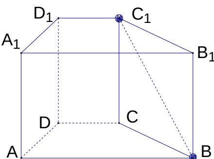

<!-- question-source:start -->
17. 已知直四棱柱 $ABCD - A_{1}B_{1}C_{1}D_{1}$ 中， $AA_{1} = 2$ ，底面是直角梯形， $\angle A = 90^{\circ}$ ， $AB \parallel CD$ ， $AB = 4'$ ，AD = 2， $DC = 1'$ ，求异面直线 $BC_{1}$ 与 DC 所成的角的大小（结果用反三角函数表示）

<!-- question-source:end -->

![[高中/真题/按年份分类/2005/2005年上海高考数学真题_理科_试卷_word解析版_/解答题/题目/answers/Q00023302A1.md]]
