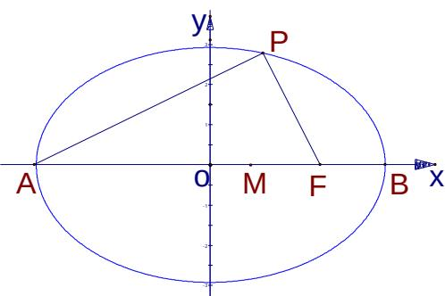

<!-- question-source:start -->
19. 点 A、B 分别是椭圆 $\frac{x^{2}}{36} + \frac{y^{2}}{20} = 1$ 长轴的左、右焦点，点 F 是椭圆的右焦点点 P 在椭圆上，
且位于 x 轴上方， $PA \perp PF$

(1) 求 P 点的坐标;

(2) 设 M 是椭圆长轴 AB 上的一点，M 到直线 AP 的距离等于 $\left|MB\right|$ ，求椭圆上的点到点 M 的距离 d 的最小值

<!-- question-source:end -->

![[高中/真题/按年份分类/2005/2005年上海高考数学真题_理科_试卷_word解析版_/解答题/题目/answers/Q00023304A1.md]]
