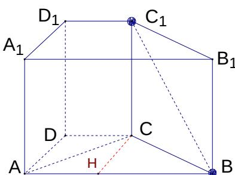
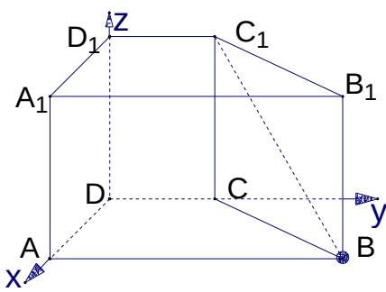

> [!faq]- 2005年上海高考数学真题（理科）试卷（word解析版）解析
>
> > [!success]- **【答案】** [解]由题意 $AB\| CD, \therefore \angle C_1BA$ 是异面直线 $BC_1$ 与 $DC$ 所成的角
>
> > [!note]- **【分析】**
> > 本题解析推导如下：
>
> > [!note]- **【解析】**
> > [解]由题意 $AB\| CD, \therefore \angle C_1BA$ 是异面直线 $BC_1$ 与 $DC$ 所成的角. 连结 $AC_1$ 与 $AC$ , 在 $Rt\triangle ADC$ 中, 可得 $AC = \sqrt{5}$ . 又在 $Rt\triangle ACC_1$ 中, 可得 $AC_1 = 3$ . 在梯形 $ABCD$ 中, 过 $C$ 作 $CH\| AD$ 交 $AB$ 于 $H$ , 得 $\angle CHB = 90^\circ, CH = 2, HB = 3, \therefore CB = \sqrt{13}$ . 又在 $Rt\triangle CBC_1$ 中, 可得 $BC_1 = \sqrt{17}$ , 在 $\triangle ABC_1$ 中, $\cos \angle C_1BA = \frac{3\sqrt{17}}{17}, \therefore \angle C_1BA = \arccos \frac{3\sqrt{17}}{17}$ 异面直线 $BC_1$ 与 $DC$ 所成角的大小为 $\arccos \frac{3\sqrt{17}}{17}$
> >
> > 
> >
> > 
> >
> > 另解:如图,以 D 为坐标原点,分别以 DA、DC、 $DD_{1}$ 所在直线为 x、y、z 轴建立直角坐标系.
> >
> > 则 $C_{1}(0,1,2), B(2,4,0), \therefore \overrightarrow{BC_{1}}=(-2,-3,2)$ ,
> >
> > $\overrightarrow{CD} = (0, -1, 0)$ , 设 $\overrightarrow{BC_1}$ 与 $\overrightarrow{CD}$ 所成的角为 $\theta$ ,
> >
> > 则 $\cos\theta=\frac{\overrightarrow{BC_{1}}\cdot\overrightarrow{CD}}{\left|\overrightarrow{BC_{1}}\right|\cdot\left|\overrightarrow{CD}\right|}=\frac{3\sqrt{17}}{17},\theta=arccos\frac{3\sqrt{17}}{17}$ .
> >
> > 异面直线 $BC_{1}$ 与 $DC$ 所成角的大小为 $\arccos \frac{3\sqrt{17}}{17}$
