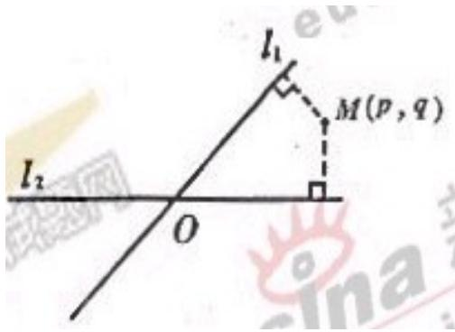

<!-- question-source:start -->
12、如图，平面中两条直线 $l_{1}$ 和 $l_{2}$ 相交于点 $O$ ，对于平面上任意一点 $M$ ，若 $p,q$ 分别是 $M$ 到直线 $l_{1}$ 和 $l_{2}$ 的距离，则称有序非负实数对 $(p,q)$ 是点 $M$

的 “距离坐标”，根据上述定义，“距离坐标” 是 (1, 2) 的点的个数是
\_\_\_\_.
一.

二、选择题（本大题满分16分）本大题共有4题，每题都给出代号为A、B、C、D的四个结论，其中有且只有一个结论是正确的，必须把正确结论的代号写在题后的圆括号内，选对得4分，不选、选错或者选出的代号超过一个（不论是否都写在

圆括号内），一律得零分。
<!-- question-source:end -->

![[高中/真题/按年份分类/2006/2006年上海高考数学真题_文科_试卷_word解析版_/填空题/题目/answers/Q00023796A1.md]]
