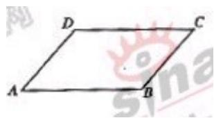

<!-- question-source:start -->
13、如图，在平行四边形ABCD中，下列结论中错误的是（）
(A) AB = DC (B) $AD + AB = AC$ (C) $AB - AD = BD$ (D) $AD + CB = 0$

<!-- question-source:end -->

![[高中/真题/按年份分类/2006/2006年上海高考数学真题_文科_试卷_word解析版_/填空题/题目/answers/Q00023797A1.md]]
