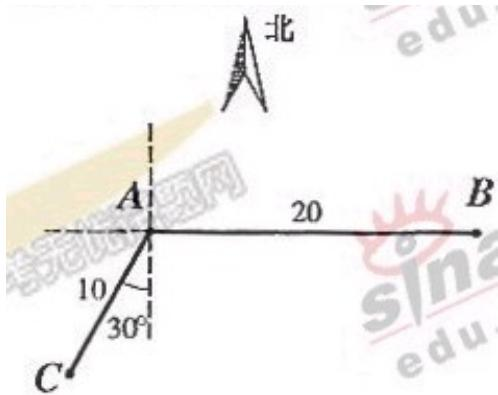

<!-- question-source:start -->
18、(本题满分 12 分) 如图, 当甲船位于 A 处时获悉, 在其正东方方向相距 20 海

里的 $B$ 处有一艘渔船遇险等待营救。甲船立即前往救援，同时把消息告知在甲船

的南偏西 $30^{\circ}$ ，相距10海里 $C$ 处的乙船，试

问乙船应朝北偏东多少度的方向沿直线前

往 B 处救援（角度精确到 $1^{\circ}$ ）？

<!-- question-source:end -->

![[高中/真题/按年份分类/2006/2006年上海高考数学真题_文科_试卷_word解析版_/解答题/题目/answers/Q00023802A1.md]]
