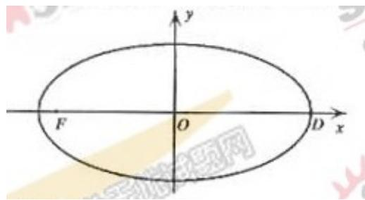

<!-- question-source:start -->
21、本题共有3个小题，第1小题满分4分，第2小题满分6分，第3小题满分6

分。

已知在平面直角坐标系 $xOy$ 中的一个椭圆，它的中心在原点，左焦点为

$F(-\sqrt{3},0)$ ，右顶点为 $D(2,0)$ ，设点 $A\left(1,\frac{1}{2}\right)$ .

(1) 求该椭圆的标准方程;

<!-- question-source:end -->

![[高中/真题/按年份分类/2006/2006年上海高考数学真题_文科_试卷_word解析版_/解答题/题目/answers/Q00031412A1.md]]
