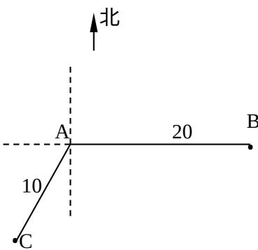

<!-- question-source:start -->
18. （本题满分 12 分）

如图，当甲船位于 A 处时获悉，在其正东方向相距 20 海里的 B 处有一艘渔船遇险等待营救。甲船立即前往救援，同时把消息告知在甲船的南偏西 30°，相距 10 海里 C 处的乙船，试问乙船应朝北偏东多少度的方向沿直线前往 B 处救援（角度精确到 1）？

[解]

<!-- question-source:end -->

![[高中/真题/按年份分类/2006/2006年上海高考数学真题_理科_试卷_word解析版_/填空题/题目/answers/Q00023214A1.md]]
