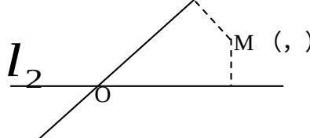

<!-- question-source:start -->
16. 如图, 平面中两条直线 $l_{1}$ 和 $l_{2}$ 相交于点 O, 对于平面上任意一点 M, 若 $p$ 、 $q$ 分别是 M 到直线 $l_{1}$ 和 $l_{2}$ 的距离, 则称有序非负实数对 $(p, q)$ 是点 M 的 “距离坐标”.

已知常数 $p \geqslant 0,\quad q \geqslant 0$ ，给出下列命题：

① 若 p = q = 0，则“距离坐标”为 $(0, 0)$ 的点有且仅有 1 个；

② 若 $pq = 0$ ，且 $p + q \neq 0$ ，则“距离坐标”为

$(p, q)$ 的点有且仅有 2 个；

③ 若 $pq \neq 0$ ，则 “距离坐标” 为 $(p, q)$ 的点有且仅有 4 个。
上述命题中，正确命题的个数是 [答]（）
(A) 0; (B) 1; (C) 2; (D) 3.

##
三. 解答题（本大题满分 86 分）本大题共有 6 题，解答下列各题必须写出必要的步骤.
<!-- question-source:end -->

![[高中/真题/按年份分类/2006/2006年上海高考数学真题_理科_试卷_word解析版_/填空题/题目/answers/Q00031554A1.md]]
