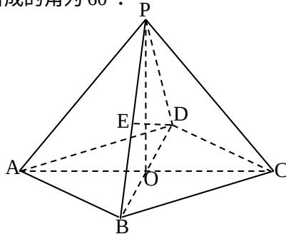

<!-- question-source:start -->
19.（本题满分14分）本题共有2个小题，第1小题满分6分，第2小题满分8分）在四棱锥P-ABCD中，底面是边长为2的菱形， $\angle DAB = 60^{\circ}$ ，对角线AC与BD相交于点O，PO⊥平面ABCD，PB与平面ABCD所成的角为 $60^{\circ}$ 。

(1) 求四棱锥 P-ABCD 的体积;

(2) 若 E 是 PB 的中点，求异面直线 DE 与 PA 所成角的大小（结果用反三角函数值表示）.

[解] (1)

(2)
<!-- question-source:end -->

![[高中/真题/按年份分类/2006/2006年上海高考数学真题_理科_试卷_word解析版_/解答题/题目/answers/Q00023215A1.md]]
