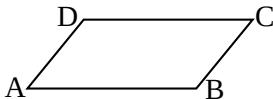

<!-- question-source:start -->
13. 如图，在平行四边形 ABCD 中，下列结论中错误的是 [答]（）
(A) $\xrightarrow{AB} = \xrightarrow{DC}$ ; (B) $\xrightarrow{AD} + \xrightarrow{AB} = \xrightarrow{AC}$ ;
(C) $\xrightarrow{AB} -\xrightarrow{AD} = \xrightarrow{BD}$ ; (D) $\xrightarrow{AD} + \xrightarrow{CB} = \xrightarrow{0}$ .

<!-- question-source:end -->

![[高中/真题/按年份分类/2006/2006年上海高考数学真题_理科_试卷_word解析版_/选择题/题目/answers/Q00023209A1.md]]
