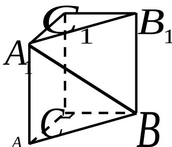

<!-- question-source:start -->
7. 如图，在直三棱柱 $ABC - A_{1}B_{1}C_{1}$ 中， $\angle ACB = 90^{\circ}$

$AA_{1}=2$ ，AC=BC=1，则异面直线 $A_{1}B$ 与AC所成角

的大小是\_\_\_\_（结果用反三角函数值表示）.

<!-- question-source:end -->

![[高中/真题/按年份分类/2007/2007年上海高考数学真题_文科_试卷_word解析版_/填空题/题目/answers/Q00027344A1.md]]
