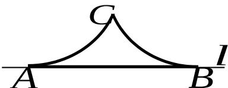

<!-- question-source:start -->
11. 如图，A, B 是直线 l 上的两点，且 AB = 2．两个半径相等的动圆分别与 l 相切于 A, B 点，C 是这两个圆的公共点，则圆弧 AC，CB 与线段 AB 围成图形面积 S 的取值范围是 \_\_\_\_。

<!-- question-source:end -->

![[高中/真题/按年份分类/2007/2007年上海高考数学真题_文科_试卷_word解析版_/填空题/题目/answers/Q00027348A1.md]]
