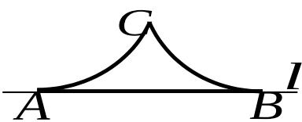

> [!faq]- 2007年上海高考数学真题（文科）试卷（word解析版）解析
>
> > [!success]- **【答案】** ②④
>
> > [!note]- **【分析】**
> > 本题未单列分析。
>
> > [!note]- **【解析】**
> > 对于①：解方程 $a + \frac{1}{a} = 0$ 得 $a = \pm i$ ，所以非零复数 $a = \pm i$ 使得 $a + \frac{1}{a} = 0$ ，① 不成立；② 显然成立；对于③：在复数集 C 中， $|1| = |i|$ ，则 $|a| = |b|$ $\boxed{\square} a = \pm b$ ，所以③ 不成立；④ 显然成立。则对于任意非零复数 $a, b$ ，上述命题仍然成立的所有序号是②④
> >
> > 
