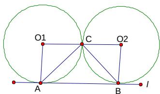

> [!faq]- 2007年上海高考数学真题（文科）试卷（word解析版）解析
>
> > [!success]- **【答案】** $\left(0,2-\frac{\pi}{2}\right]$
>
> > [!note]- **【分析】**
> > 本题未单列分析。
>
> > [!note]- **【解析】**
> > 如图，当 $\odot O_{1}$ 与 $\odot O_{2}$ 外切于点 C 时，S 最大，
> > 此时，两圆半径为 1，S 等于矩形 $ABO_{2}O_{1}$ 的面积减去两扇形面积， $\therefore S_{\max}=2\times1-2\times(\frac{1}{4}\times\pi\times1^{2})=2-\frac{\pi}{2}$ 随着圆半径的变化，C 可以向直线 l 靠近，
> > 当 C 到直线 l 的距离 $d \rightarrow 0$ 时， $S \rightarrow 0, \therefore S \in (0,2-\infty)$
> >
> > 
> > 二．选择题（本大题满分16分）本大题共有4题，每题都给出代号为A，B，C，D的四个结论，其中有且只有一个结论是正确的，必须把正确结论的代号写在题后的圆括号内，选对得4分，不选、选错或者选出的代号超过一个（不论是否都写在圆括号内），一律得零分.
