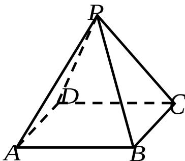

<!-- question-source:start -->
16. （本题满分 12 分）
如图, 在正四棱锥 P - ABCD 中, PA = 2, 直线 PA 与平面 ABCD 所成的角为 $60^{\circ}$ ,
求正四棱锥 P - ABCD 的体积 V .

## 17. (本题满分 14 分)

在 $\triangle ABC$ 中， $a, b, c$ 分别是三个内角 $A, B, C$ 的对边．若 $a = 2, C = \frac{\pi}{4}$ ， $\cos \frac{B}{2} = \frac{2\sqrt{5}}{5}$ ，求 $\triangle ABC$ 的面积 $S$ ．
<!-- question-source:end -->

![[高中/真题/按年份分类/2007/2007年上海高考数学真题_文科_试卷_word解析版_/解答题/题目/answers/Q00026393A1.md]]
