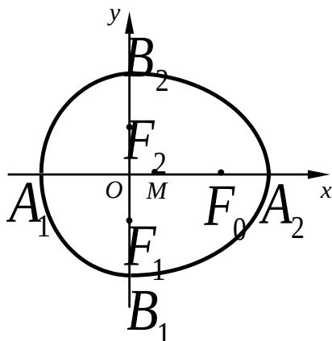

<!-- question-source:start -->
20. （本题满分 18 分）本题共有 3 个小题，第 1 小题满分 3 分，第 2 小题满分 6 分，

第3小题满分9分.

如果有穷数列 $a_{1}, a_{2}, a_{3}, \ldots, a_{m}$ （ $m$ 为正整数）满足条件 $a_{1} = a_{m}, a_{2} = a_{m-1}, \ldots, a_{m} = a_{1}$ ，

即 $a_{i} = a_{m - i + 1}$ （ $i = 1,2,\dots,m$ ），我们称其为“对称数列”。

例如，数列1,2,5,2,1与数列8,4,2,2,4,8都是“对称数列”。

(1) 设 $\left\{b_{n}\right\}$ 是 7 项的 “对称数列”，其中 $b_{1}, b_{2}, b_{3}, b_{4}$ 是等差数列，且 $b_{1} = 2, b_{4} = 11$ 。

依次写出 $\left\{b_{n}\right\}$ 的每一项；

(2) 设 $\left\{c_{n}\right\}$ 是 49 项的“对称数列”，其中 $c_{25}, c_{26}, \ldots, c_{49}$ 是首项为 1，

公比为 $_{2}$ 的等比数列，求 $\left\{c_{n}\right\}$ 各项的和S；

(3) 设 $\left\{d_{n}\right\}$ 是 $100$ 项的“对称数列”，其中 $d_{51}, d_{52}, \ldots, d_{100}$ 是首项为 $2$

公差为 3 的等差数列．求 $\left\{d_{n}\right\}$ 前 n 项的和 $S_{n}(n=1,2,\cdots,100)$

$$
^ 2
$$

$$
^ 3
$$

我们把由半椭圆 $\frac{x^{2}}{a^{2}}+\frac{y^{2}}{b^{2}}=1\quad(x\geq0)$ 与半椭圆 $\frac{y^{2}}{b^{2}}+\frac{x^{2}}{c^{2}}=1\quad(x\leq0)$ 合成的曲线

称作 “果圆”，其中 $a^{2}=b^{2}+c^{2}$ ，a>0，b>c>0。

如图，设点 $F_{0}$ ， $F_{1}$ ， $F_{2}$ 是相应椭圆的焦点， $A_{1}$ ， $A_{2}$ 和 $B_{1}$ ， $B_{2}$ 是 “果圆”

与 $x, y$ 轴的交点， $M$ 是线段 $A_{1}A_{2}$ 的中点.

(1) 若 $\triangle F_{0}F_{1}F_{2}$ 是边长为 1 的等边三角形，求该“果圆”的方程；

(2) 设 $P$ 是“果圆”的半椭圆 $\frac{y^2}{b^2} + \frac{x^2}{c^2} = 1$

$(x \leq 0)$ 上任意一点．求证：当 $|PM|$ 取得

最小值时， $P$ 在点 $B_{1}, B_{2}$ 或 $A_{1}$ 处；

(2) 若 P 是 “果圆” 上任意一点，求 $\left|PM\right|$ 取得最小值时点 P 的横坐标.

# 2007 年普通高等学校招生全国统一考试（上海卷）

# 数学试卷(文史类)

(满分 150 分，考试时间 120 分钟)

## 考生注意
<!-- question-source:end -->

![[高中/真题/按年份分类/2007/2007年上海高考数学真题_文科_试卷_word解析版_/解答题/题目/answers/Q00026396A1.md]]
