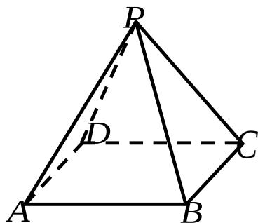

<!-- question-source:start -->
17. 如图,在正四棱锥 P - ABCD 中，PA = 2，直线 PA 与平面 ABCD 所成的角为 $60^{\circ}$ ，

求正四棱锥 P - ABCD 的体积 V .

【
<!-- question-source:end -->

![[高中/真题/按年份分类/2007/2007年上海高考数学真题_文科_试卷_word解析版_/解答题/题目/answers/Q00026408A1.md]]
