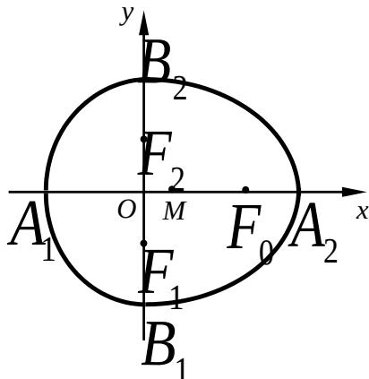

<!-- question-source:start -->
21. （本题满分 18 分）本题共有 3 个小题，第 1 小题满分 4 分，第 2 小题满分 5 分，

## 第3小题满分9分.

我们把由半椭圆 $\frac{x^{2}}{a^{2}}+\frac{y^{2}}{b^{2}}=1\quad(x\geq0)$ 与半椭圆 $\frac{y^{2}}{b^{2}}+\frac{x^{2}}{c^{2}}=1\quad(x\leq0)$ 合成的曲线

称作“果圆”，其中 $a^2 = b^2 + c^2$ ， $a > 0$ ， $b > c > 0$

如图，设点 $F_{0}$ ， $F_{1}$ ， $F_{2}$ 是相应椭圆的焦点， $A_{1}$ ， $A_{2}$ 和 $B_{1}$ ， $B_{2}$ 是“果圆”

与 $x, y$ 轴的交点， $M$ 是线段 $A_{1}A_{2}$ 的中点.

(3) 若 $\triangle F_{0}F_{1}F_{2}$ 是边长为 1 的等边三角形，求该“果圆”的方程；

(2) 设 $P$ 是“果圆”的半椭圆 $\frac{y^2}{b^2} + \frac{x^2}{c^2} = 1$

$(x \leq 0)$ 上任意一点．求证：当 $|PM|$ 取得

最小值时， $P$ 在点 $B_{1}, B_{2}$ 或 $A_{1}$ 处；

(4) 若 $P$ 是“果圆”上任意一点，求 $|PM|$ 取得最小值时点 $P$ 的横坐标.

【
<!-- question-source:end -->

![[高中/真题/按年份分类/2007/2007年上海高考数学真题_文科_试卷_word解析版_/解答题/题目/answers/Q00026409A1.md]]
