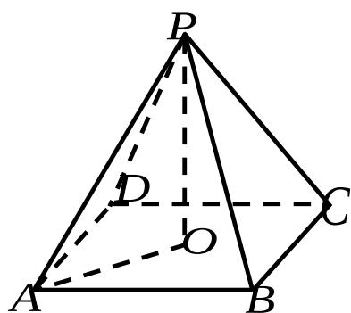

> [!faq]- 2007年上海高考数学真题（文科）试卷（word解析版）解析
>
> > [!success]- **【答案】** 详见解析
>
> > [!note]- **【分析】**
> > 本题未单列分析。
>
> > [!note]- **【解析】**
> > 作 $PO \perp$ 平面 ABCD，垂足为 O．连接 AO，
> >
> > $O$ 是正方形 $ABCD$ 的中心， $\angle PAO$ 是直线 $PA$ 与平面
> >
> > ABCD 所成的角.
> >
> > $$
> > \angle P A O = 6 0 ^ {\circ}, \quad P A = 2. \therefore P O = \sqrt {3}.
> > $$
> >
> > $$
> > A O = 1, A B = \sqrt {2}
> > $$
> >
> > $$
> > \therefore V = \frac {1}{3} P O \square S _ {A B C D} = \frac {1}{3} \times \sqrt {3} \times 2 = \frac {2 \sqrt {3}}{3}.
> > $$
> >
> > 
> >
> > ## 17. (本题满分 14 分)
> >
> > 在 $\triangle ABC$ 中， $a, b, c$ 分别是三个内角 $A, B, C$ 的对边．若 $a = 2, C = \frac{\pi}{4}$
> >
> > $\cos\frac{B}{2}=\frac{2\sqrt{5}}{5}$ ，求 $\triangle ABC$ 的面积S.
> >
> > 【
