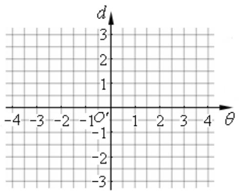

<!-- question-source:start -->
11. 已知 $P$ 为圆 $x^{2} + (y - 1)^{2} = 1$ 上任意一点（原点 $O$ 除外），直线的倾斜角为 $\theta$ 弧度，记 $d = |OP|$ 。在右侧的坐标系中，画出以 $(\theta, d)$ 为坐标的点的轨迹的大致图形为

二．选择题（本大题满分16分）本大题共有4题，每题都给出代号为A，B，C，D的四个结论，其中有且只有一个结论是正确的，必须把正确结论的代号写在题后的圆括号内，选对得4分，不选、选错或者选出的代号超过一个（不论是否都写在圆括号内），一律得零分.
<!-- question-source:end -->

![[高中/真题/按年份分类/2007/2007年上海高考数学真题_理科_试卷_word解析版_/填空题/题目/answers/Q00025918A1.md]]
